# Architektur: Mini-LLM Decoder-Only Transformer

> Eine ausführliche Erklärung für alle, die noch wenig Erfahrung mit LLM-Programmierung haben.  
> Ziel: Jede Zeile Code soll verstanden werden – nicht nur *was* sie tut, sondern *warum*.

---

## Inhaltsverzeichnis

1. [Das große Bild – Was tut ein Sprachmodell überhaupt?](#1-das-große-bild)
2. [Vom Text zu Zahlen – Tokenisierung und Embedding](#2-vom-text-zu-zahlen)
   - [2.1 Character-Level-Tokenizer](#21-character-level-tokenizer)
   - [2.2 BPE-Tokenizer (Byte Pair Encoding)](#22-bpe-tokenizer-byte-pair-encoding)
   - [2.3 Token-Embedding](#23-token-embedding)
   - [2.4 Positions-Embedding](#24-positions-embedding)
3. [Der Attention-Mechanismus – Wie Tokens „miteinander sprechen"](#3-der-attention-mechanismus)
4. [Multi-Head Attention – Mehrere Perspektiven gleichzeitig](#4-multi-head-attention)
5. [Feed-Forward-Netz – Nichtlineare Transformation](#5-feed-forward-netz)
6. [Der vollständige Transformer-Block](#6-der-vollständige-transformer-block)
7. [Das vollständige Modell – MiniTransformer](#7-das-vollständige-modell)
8. [Training – Wie lernt das Modell?](#8-training)
9. [Textgenerierung – Temperature und Top-k](#9-textgenerierung)
10. [Hyperparameter und ihre Wirkung](#10-hyperparameter-und-ihre-wirkung)
11. [Dateiübersicht](#11-dateiübersicht)

---

## 1. Das große Bild

Ein **Sprachmodell** lernt, den nächsten wahrscheinlichsten Token (hier: das nächste Zeichen) vorherzusagen, gegeben allen bisherigen Zeichen. Das klingt simpel, führt aber zu erstaunlich guten Ergebnissen.

```
Eingabe:  "Der Hund b"
Aufgabe:  Was kommt als nächstes? → "e" (aus "bellt") oder "i" (aus "bissig") oder ...
Ausgabe:  Wahrscheinlichkeit über alle bekannten Zeichen
```

Dieser Mini-Transformer ist ein **Decoder-Only** Modell (wie GPT). „Decoder-Only" bedeutet: Es gibt nur den Teil, der Text generiert – keinen separaten Encoder, der eine andere Sprache oder einen anderen Kontext verarbeitet. Es sieht immer nur die bisherigen Tokens, nie die zukünftigen.

### Gesamtarchitektur auf einen Blick

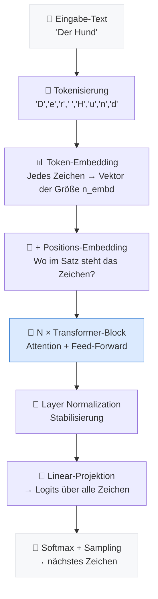

---

## 2. Vom Text zu Zahlen

Neuronale Netze arbeiten mit Zahlen, nicht mit Text. Der erste Schritt ist daher die **Tokenisierung**: Text wird in eine Folge von Ganzzahlen (Token-IDs) umgewandelt. Das Projekt bietet zwei Tokenizer-Implementierungen in [`tokenizer.py`](tokenizer.py), wählbar über den `--tokenizer`-Parameter in [`train.py`](train.py).

> 🔗 Eine anschauliche Erklärung im Bibliotheks-Bild (was ein Token ist, was ein Steckbrief) findest du in [docs/explainers/how-it-works.md → Station 1](docs/explainers/how-it-works.md).

### 2.1 Character-Level-Tokenizer

Der [`CharTokenizer`](tokenizer.py:61) ist der einfachste mögliche Ansatz: **jedes Zeichen = ein Token**.

```python
# Alle einzigartigen Zeichen im Training-Text sammeln und sortieren
chars = sorted(set(text))          # z.B. [' ', '!', 'A', 'B', ..., 'z']
stoi  = {ch: i for i, ch in enumerate(chars)}   # str → int  ("A" → 12)
itos  = {i: ch for i, ch in enumerate(chars)}   # int → str  (12 → "A")
```

> **Beispiel:** `"Hund"` → `[23, 44, 31, 12]`
> Die konkreten Zahlen hängen vom Training-Text ab.

**Vorteile:**
- Extrem einfach, kein Trainingsschritt nötig
- Kleines Vokabular (Anzahl einzigartiger Zeichen, typisch 60–150)
- Kann jede Zeichenfolge enkodieren – keine unbekannten Token

**Nachteile:**
- Das Modell muss Wörter **Buchstabe für Buchstabe** lernen
- Lange Sequenzen: `"Transformer"` belegt 11 Token statt 1–3
- Das begrenzte Kontextfenster (`block_size`) wird von einzelnen Zeichen aufgebraucht

---

### 2.2 BPE-Tokenizer (Byte Pair Encoding)

Der [`BPETokenizer`](tokenizer.py:98) ist der Industriestandard (verwendet von GPT-2, GPT-4, LLaMA u. a.). Er lernt **Subword-Tokens** aus dem Training-Text: häufige Zeichenkombinationen werden zu einem einzigen Token zusammengefasst.

#### Der Algorithmus in drei Schritten

```
Ausgangspunkt: Zeichenfolge  →  "d", "i", "e", " ", "K", "a", "t", "z", "e"

Schritt 1 – Startvokabular:   alle einzigartigen Zeichen   (wie CharTokenizer)
Schritt 2 – Häufigstes Paar:  ("K","a") kommt 847-mal vor → neues Token "Ka"
Schritt 3 – Ersetzen:         "Ka", "t", "z", "e"
             → weiter bis vocab_size erreicht ist
```

Die Implementierung in [`BPETokenizer.train()`](tokenizer.py:131) arbeitet **wortbasiert** für Effizienz: statt den gesamten Text als flache Zeichenfolge zu verwalten, werden zuerst Wort-Häufigkeiten gezählt und Merges auf diesen kompakten Wort-Repräsentationen durchgeführt. Das reduziert die Komplexität von O(`vocab_size × gesamt_zeichen`) auf O(`vocab_size × einzigartige_wörter`).

```python
# Vereinfachtes Beispiel aus BPETokenizer.train():
while len(stoi) < vocab_size:
    pair_counts = get_pair_counts(word_freq)          # häufigstes Paar suchen
    best = max(pair_counts, key=pair_counts.get)      # z.B. ("t", "h") → "th"
    stoi["th"] = new_id                               # ins Vokabular aufnehmen
    merges.append(best)                               # Merge-Reihenfolge merken
    word_freq = apply_merge(word_freq, best)          # alle Wörter aktualisieren
```

Beim **Enkodieren** werden dieselben Merges in derselben Reihenfolge auf den Text angewendet (siehe [`BPETokenizer.encode()`](tokenizer.py:222)).

**Vorteile:**
- **Komprimiert** Sequenzen stark: `"der"` → 1 Token statt 3
- Häufige Wörter bekommen eigene Tokens, seltene werden in bekannte Subwords zerlegt
- Das Kontextfenster nutzt semantisch reichhaltigere Einheiten
- Typische Kompressionsrate: 3–5× gegenüber Zeichenebene

**Nachteile:**
- Erfordert einen **Trainingsschritt** (dauert einige Sekunden bis Minuten)
- Vokabular und Merges müssen zusammen mit dem Modell gespeichert werden
- Etwas komplexere Implementierung

#### Visueller Vergleich: dasselbe Wort mit beiden Tokenizern

```
Text:  "Transformer"

CharTokenizer  →  11 Tokens:  ["T","r","a","n","s","f","o","r","m","e","r"]

BPETokenizer   →   3 Tokens:  ["Trans","form","er"]
(bei vocab_size=2000, nach Training auf deutschem Wikipedia-Text)
```

#### Gegenüberstellung

| Eigenschaft           | CharTokenizer            | BPETokenizer                    |
|-----------------------|--------------------------|---------------------------------|
| Vokabulargröße        | ~60–150 (fest)           | konfigurierbar (Standard: 2000) |
| Trainingsschritt      | keiner                   | ja (wenige Sekunden–Minuten)    |
| Tokens pro Wort       | viele (1 pro Zeichen)    | wenige (1–3 Subwords)           |
| Kontextnutzung        | ineffizient              | effizient                       |
| Unbekannte Zeichen    | werden übersprungen      | werden übersprungen             |
| Geeignet für          | Experimente, Debugging   | realistisches Training          |
| Aktivierung           | `--tokenizer char`       | `--tokenizer bpe` (Standard)    |

---

### 2.3 Token-Embedding

Ein Embedding ist eine **Lookup-Tabelle**: Für jeden der `vocab_size` Token-Typen gibt es einen lernbaren Vektor der Größe `n_embd`. 

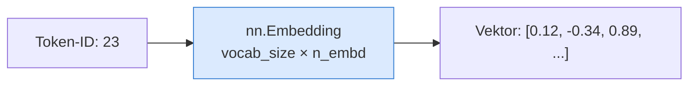

```python
# In model.py, MiniTransformer.__init__:
self.token_embedding = nn.Embedding(vocab_size, n_embd)
```

Am Anfang des Trainings sind diese Vektoren zufällig. Durch das Training lernt das Modell, ähnliche Zeichen/Muster mit ähnlichen Vektoren zu repräsentieren.

### 2.4 Positions-Embedding

Attention-Operationen an sich sind **positionsunabhängig** – `q @ k.T` produziert das gleiche Ergebnis, egal ob Token A vor oder nach Token B steht. Um die Reihenfolge der Zeichen zu erhalten, wird ein zusätzliches **Positions-Embedding** addiert:

```python
# In model.py, MiniTransformer.forward:
tok_emb = self.token_embedding(idx)                              # (B, T, n_embd)
pos_emb = self.position_embedding(torch.arange(T, device=...))  # (T, n_embd)
x = tok_emb + pos_emb   # Positionen "eingewoben"
```

Für jede der `block_size` möglichen Positionen (0 bis 127) gibt es einen eigenen lernbaren Vektor. So lernt das Modell, was es bedeutet, an erster, zweiter, ... Stelle zu stehen.

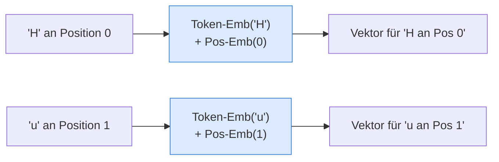

---

## 3. Der Attention-Mechanismus

Dies ist der **Kern des Transformers**. Der Attention-Mechanismus entscheidet für jede Position: *Welche anderen Positionen im Kontext sind für mich relevant?*

Implementiert in der Klasse [`Head`](model.py:27).

### 3.1 Query, Key, Value

Jeder Eingabe-Vektor wird durch drei separate lineare Projektionen in drei Rollen umgewandelt:

| Rolle | Analogie | Bedeutung |
|---|---|---|
| **Query (Q)** | „Was suche ich?" | Die aktuelle Position fragt, welche anderen Tokens wichtig für sie sind |
| **Key (K)** | „Was biete ich an?" | Jede Position teilt mit, welche Information sie enthält |
| **Value (V)** | „Was gebe ich weiter?" | Die eigentliche Information, die bei einem Match übergeben wird |

```python
# In model.py, Head.__init__:
self.key   = nn.Linear(n_embd, head_size, bias=False)
self.query = nn.Linear(n_embd, head_size, bias=False)
self.value = nn.Linear(n_embd, head_size, bias=False)
```

### 3.2 Scaled Dot-Product Attention

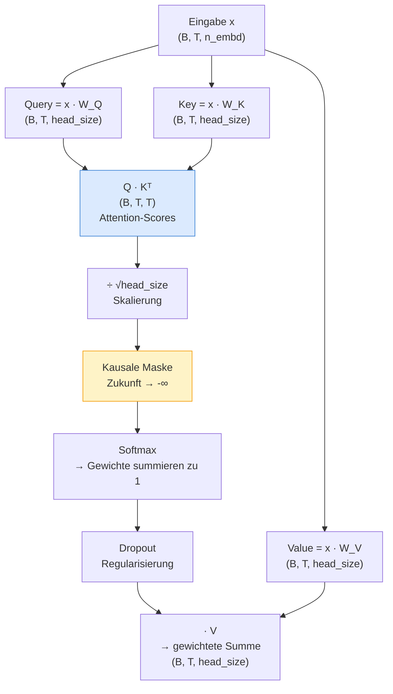

**Schritt für Schritt im Code** ([`Head.forward()`](model.py:44)):

```python
def forward(self, x):
    B, T, C = x.shape          # Batch-Größe, Zeitschritte, Kanäle

    k = self.key(x)            # (B, T, head_size)
    q = self.query(x)          # (B, T, head_size)
    head_size = k.shape[-1]

    # 1) Scores: Wie gut passt jede Query zu jedem Key?
    wei = q @ k.transpose(-2, -1) * (head_size ** -0.5)   # (B, T, T)
    #                                  ↑ Skalierung: ohne sie werden die Werte
    #                                    zu groß und der Softmax saturiert

    # 2) Kausale Maske: Position i darf nur Position 0..i sehen
    wei = wei.masked_fill(self.tril[:T, :T] == 0, float("-inf"))
    
    # 3) Softmax: Scores → Gewichte (summieren zu 1)
    wei = F.softmax(wei, dim=-1)
    wei = self.dropout(wei)

    # 4) Gewichtete Summe der Values
    v = self.value(x)          # (B, T, head_size)
    return wei @ v             # (B, T, head_size)
```

### 3.3 Warum die kausale Maske?

Beim **Trainieren** kennen wir den gesamten Text. Aber das Modell soll lernen, den nächsten Token vorherzusagen – also darf es beim Vorausschauen nicht „schummeln" und bereits das Ziel sehen.

```
Position:  0    1    2    3    4
Zeichen:   D    e    r    _    H

Position 2 ('r') darf sehen:   D, e, r       ✓
Position 2 ('r') darf NICHT:   _, H          ✗  → wird auf -∞ gesetzt
```

Die untere Dreiecksmatrix `tril` realisiert genau das:

```
tril (4×4):
[[1, 0, 0, 0],
 [1, 1, 0, 0],
 [1, 1, 1, 0],
 [1, 1, 1, 1]]
```

Wo eine `0` steht, wird der Attention-Score auf `-∞` gesetzt. Nach dem Softmax wird `-∞` zu `0` – diese Positionen werden also vollständig ignoriert.

---

## 4. Multi-Head Attention

Ein einzelner Attention-Head kann nur eine „Perspektive" lernen. Mit **Multi-Head Attention** laufen mehrere Heads **parallel** – jeder kann andere Aspekte der Beziehungen lernen (z.B. grammatikalische Abhängigkeiten, semantische Nähe, Satzstruktur).

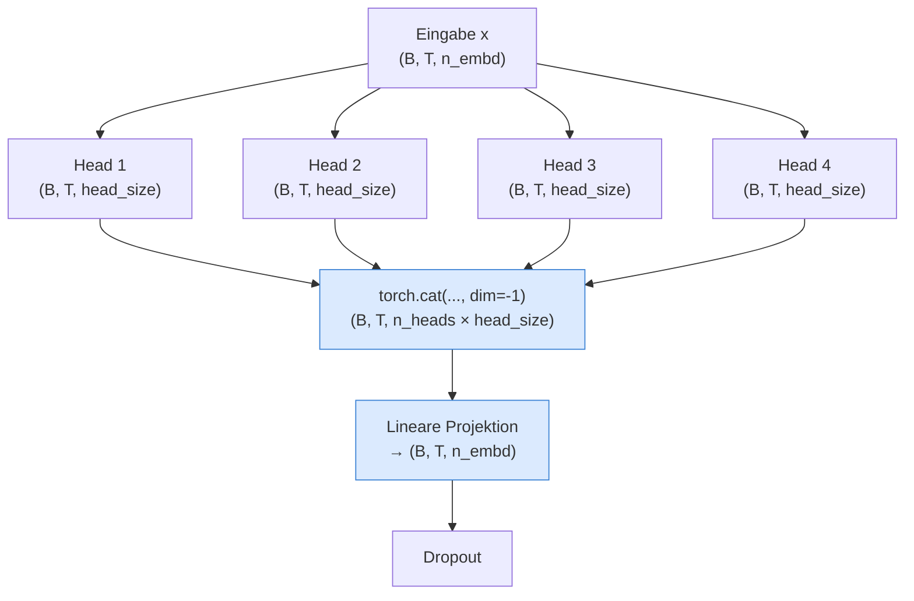

```python
# In model.py, MultiHeadAttention:
class MultiHeadAttention(nn.Module):
    def __init__(self, n_heads, head_size, n_embd, block_size, dropout):
        self.heads = nn.ModuleList([
            Head(head_size, n_embd, block_size, dropout) for _ in range(n_heads)
        ])
        self.proj    = nn.Linear(n_heads * head_size, n_embd)  # wieder auf n_embd projizieren
        self.dropout = nn.Dropout(dropout)

    def forward(self, x):
        out = torch.cat([h(x) for h in self.heads], dim=-1)   # alle Heads konkatenieren
        return self.dropout(self.proj(out))                    # projizieren + Dropout
```

> **Tipp:** `head_size = n_embd // n_heads`. Bei `n_embd=64` und `n_heads=4` ist `head_size=16`. Die Gesamtbreite bleibt also konstant – es ist nur eine andere Aufteilung der Kapazität.

---

## 5. Feed-Forward-Netz

Nach der Attention folgt ein einfaches **2-schichtiges MLP** (Multi-Layer Perceptron), das **positionsweise** arbeitet – d.h. jede Position im Kontext wird unabhängig von den anderen transformiert.

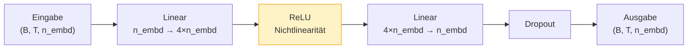

```python
# In model.py, FeedForward:
self.net = nn.Sequential(
    nn.Linear(n_embd, 4 * n_embd),   # Expansion: 4× breiter (klassische GPT-Skalierung)
    nn.ReLU(),                         # Nichtlinearität (GPT-2/3 nutzt GELU, hier ReLU)
    nn.Linear(4 * n_embd, n_embd),    # Projektion zurück auf n_embd
    nn.Dropout(dropout),
)
```

**Warum 4×?** Das ist eine empirisch bewährte Heuristik aus dem originalen Transformer-Paper. Die Expansion ermöglicht dem Netz, komplexere Transformationen zu lernen, bevor es wieder auf die Modell-Dimension komprimiert.

**Warum braucht es das FFN überhaupt?** Attention alleine ist eine gewichtete Summe – eine lineare Operation. ReLU fügt Nichtlinearität hinzu, ohne die das Modell keine komplexen Funktionen approximieren könnte.

---

## 6. Der vollständige Transformer-Block

Attention und FFN werden in einem **Block** kombiniert, mit zwei wichtigen Ergänzungen: **LayerNorm** und **Residual-Verbindungen**.

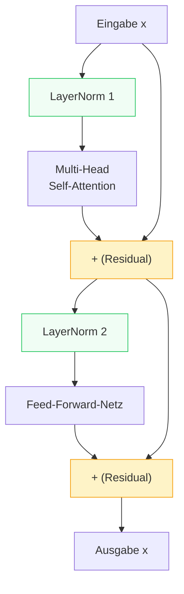

```python
# In model.py, Block.forward:
def forward(self, x):
    x = x + self.sa(self.ln1(x))   # Residual um Attention
    x = x + self.ff(self.ln2(x))   # Residual um FFN
    return x
```

### 6.1 Warum Residual-Verbindungen?

**Problem ohne Residuals:** In tiefen Netzen (viele Schichten) verschwinden die Gradienten beim Backpropagation (*Vanishing Gradients*). Die frühen Schichten bekommen kaum noch Lernsignal.

**Lösung:** `x = x + f(x)` – die Eingabe wird direkt zur Ausgabe addiert. Das schafft einen "Kurzschluss", durch den Gradienten direkt zurückfließen können. Im schlimmsten Fall lernt das Modell `f(x) = 0` und die Schicht wird überbrückt.

### 6.2 Warum Layer Normalization?

LayerNorm normalisiert die Aktivierungen innerhalb jedes Tokens auf Mittelwert 0 und Standardabweichung 1. Das stabilisiert das Training, weil extreme Werte (sehr groß oder sehr klein) die Gradienten destabilisieren.

Hier wird **Pre-LayerNorm** verwendet (`ln` *vor* Attention/FFN), was moderner und stabiler ist als das originale Post-Norm Schema des Attention-Is-All-You-Need-Papers.

---

## 7. Das vollständige Modell

Die Klasse [`MiniTransformer`](model.py:131) kombiniert alle Komponenten:

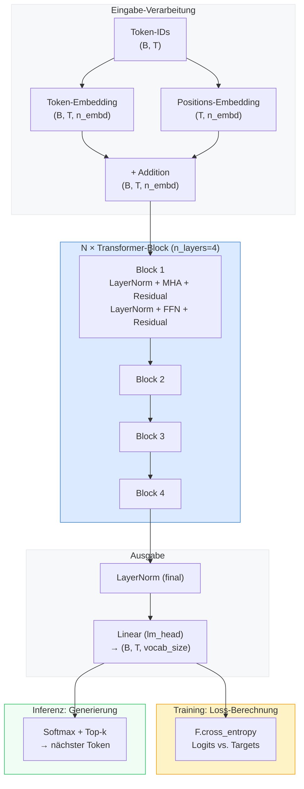

### 7.1 Parameter-Initialisierung

```python
# In model.py, MiniTransformer._init_weights:
@staticmethod
def _init_weights(module):
    if isinstance(module, nn.Linear):
        nn.init.normal_(module.weight, mean=0.0, std=0.02)
```

Alle linearen Gewichte werden mit einer kleinen Normalverteilung (σ=0.02) initialisiert. Das ist wichtig: Zu große Startwerte führen zu Instabilität im Training, zu kleine Werte bedeuten, dass die Gradienten anfangs verschwinden.

### 7.2 Forward Pass

```python
def forward(self, idx, targets=None):
    B, T = idx.shape
    tok_emb = self.token_embedding(idx)                              # (B, T, n_embd)
    pos_emb = self.position_embedding(torch.arange(T, device=...))  # (T, n_embd)
    x = tok_emb + pos_emb

    x = self.blocks(x)         # durch alle N Transformer-Blöcke
    x = self.ln_final(x)       # finale Normalisierung
    logits = self.lm_head(x)   # (B, T, vocab_size)  ← Rohe Scores für jedes Zeichen

    loss = None
    if targets is not None:
        B, T, V = logits.shape
        # Cross-Entropy: wie weit weicht die Vorhersage vom echten nächsten Zeichen ab?
        loss = F.cross_entropy(logits.view(B * T, V), targets.view(B * T))

    return logits, loss
```

---

## 8. Training

Das Training ist in [`train.py`](train.py) implementiert. Das Ziel: Die Modellgewichte so anpassen, dass der Loss (Vorhersagefehler) sinkt.

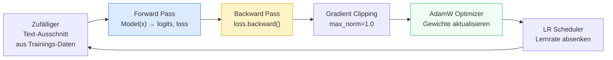

### 8.0 Backward Pass und Vanishing Gradient

Nach dem Forward Pass und der Loss-Berechnung läuft `loss.backward()` den Computation Graph **rückwärts** ab und berechnet für jede lernbare Matrix ihren Gradienten — die Antwort auf: *„In welche Richtung und wie stark muss sich diese Zahl ändern, damit der Loss sinkt?"*

In tiefen Netzen werden Gradienten beim Rückwärtsdurchlauf mit jedem Schritt kleiner (**Vanishing Gradient**), weil die Kettenregel viele Ableitungen miteinander multipliziert. Die **Residual-Verbindungen** aus Kap. 6.1 mildern das ab: der Gradient kann über den direkten `+`-Pfad zurückfließen, ohne durch Attention oder FFN gedämpft zu werden.

> 🔗 Eine ausführliche Erklärung mit Bibliotheks-Analogie und Debugger-Ausdrücken: [docs/explainers/how-it-works.md → Schritt 3](docs/explainers/how-it-works.md).

### 8.1 Batching

```python
# In train.py, get_batch:
ix = torch.randint(len(data) - block_size, (batch_size,))
x  = torch.stack([data[i     : i + block_size    ] for i in ix])
y  = torch.stack([data[i + 1 : i + block_size + 1] for i in ix])
```

Ein **Batch** besteht aus `batch_size` zufälligen Ausschnitten der Länge `block_size` aus dem Trainingstext. `y` ist dabei genau ein Zeichen gegenüber `x` verschoben – das ist das Lernziel: für jede Position in `x` soll das Modell das entsprechende Zeichen in `y` vorhersagen.

```
x: [ D, e, r, _, H, u, n ]
y: [ e, r, _, H, u, n, d ]
         ↑ Jeweils das nächste Zeichen
```

### 8.2 Loss: Cross-Entropy

**Cross-Entropy** misst, wie falsch die Vorhersagen sind. Wenn das Modell dem richtigen nächsten Zeichen eine hohe Wahrscheinlichkeit gibt, ist der Loss niedrig; bei gleichverteilten oder falschen Vorhersagen ist er hoch.

> **Faustregel:** `loss = ln(vocab_size)` ist der Loss bei reinem Raten. Für ein Vokabular von ~70 Zeichen: `ln(70) ≈ 4.25`. Ein trainiertes Modell sollte deutlich darunter liegen.

### 8.3 AdamW Optimizer

```python
optimizer = torch.optim.AdamW(model.parameters(), lr=cfg["learning_rate"])
```

AdamW ist eine Variante von Adam (Adaptive Moment Estimation), die Weight Decay korrekt implementiert. Er passt die Lernrate für jeden Parameter individuell an – Parameter, die selten aktualisiert werden, bekommen größere Schritte.

### 8.4 Gradient Clipping

```python
torch.nn.utils.clip_grad_norm_(model.parameters(), max_norm=1.0)
```

Wenn Gradienten sehr groß werden (*exploding gradients*), kann ein einziger Update-Schritt das Modell destabilisieren. Gradient Clipping begrenzt die Norm des Gesamt-Gradienten auf `max_norm=1.0`.

### 8.5 Lernraten-Scheduler

```python
scheduler = torch.optim.lr_scheduler.LinearLR(
    optimizer, start_factor=1.0, end_factor=0.1, total_iters=cfg["max_iters"]
)
```

Am Anfang lernt das Modell schnell (hohe Lernrate). Gegen Ende sollte es feine Anpassungen machen (niedrige Lernrate). Der Scheduler senkt die Lernrate linear von 100% auf 10% des Startwertes ab.

---

## 9. Textgenerierung

Nach dem Training kann das Modell autoregressiv Text generieren – Token für Token:

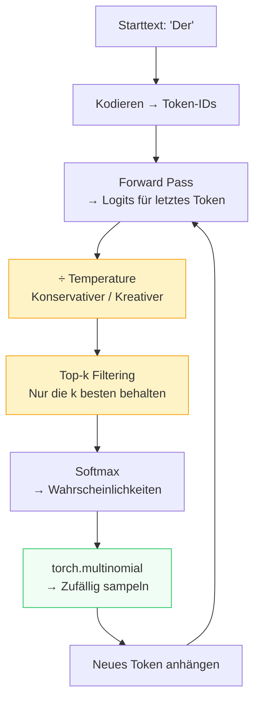

```python
# In model.py, MiniTransformer.generate:
for _ in range(max_new_tokens):
    idx_cond = idx[:, -self.block_size:]            # Kontext begrenzen
    logits, _ = self(idx_cond)
    logits = logits[:, -1, :] / temperature         # Nur letztes Token, Temperature anwenden

    if top_k is not None:
        v, _ = torch.topk(logits, min(top_k, logits.size(-1)))
        logits[logits < v[:, [-1]]] = float("-inf") # Alles außer Top-k auf -∞

    probs    = F.softmax(logits, dim=-1)
    idx_next = torch.multinomial(probs, num_samples=1)  # Zufällig sampeln
    idx      = torch.cat([idx, idx_next], dim=1)        # Neues Token anhängen
```

### 9.1 Temperature

| Temperature | Effekt | Wann verwenden? |
|---|---|---|
| `0.2 – 0.5` | Konservativ, wiederholt sich | Wenn Kohärenz wichtig ist |
| `0.8` | Gute Balance (Standard) | Meistens |
| `1.0` | Original-Verteilung | Neutrale Sampling |
| `1.2 – 2.0` | Kreativ, chaotisch | Experimentieren |

### 9.2 Top-k Sampling

Ohne Top-k könnte das Modell sehr unwahrscheinliche Tokens sampeln. Mit `top_k=40` werden alle außer den 40 wahrscheinlichsten Kandidaten auf `−∞` gesetzt (→ Wahrscheinlichkeit 0). Das verbessert die Qualität deutlich.

---

## 10. Hyperparameter und ihre Wirkung

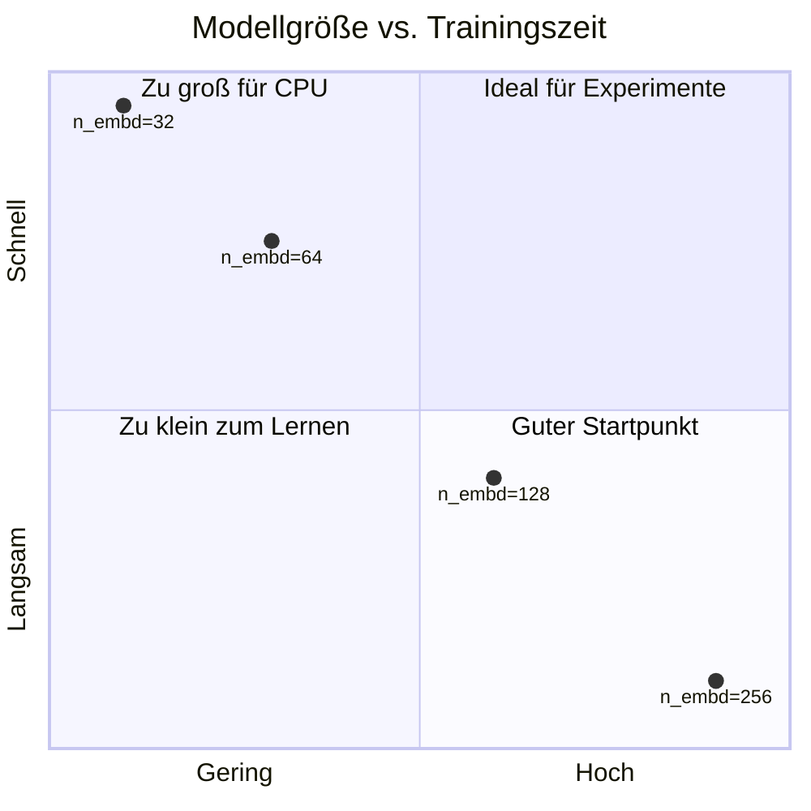

| Parameter | Standard | Klein | Groß | Effekt |
|---|---|---|---|---|
| `n_embd` | 64 | 32 | 256 | Breite des Modells, beeinflusst alle Schichten |
| `n_heads` | 4 | 2 | 8 | Mehr Perspektiven in der Attention |
| `n_layers` | 4 | 1 | 6 | Tiefe – mehr Abstraktionsstufen |
| `block_size` | 128 | 32 | 256 | Kontextfenster – wie weit das Modell zurückschaut |
| `dropout` | 0.2 | 0.0 | 0.4 | Regularisierung – verhindert Überanpassung |
| `learning_rate` | 1e-3 | 1e-4 | 5e-3 | Schrittgröße beim Lernen |
| `batch_size` | 32 | 16 | 64 | Anzahl paralleler Trainingsbeispiele |

**Wichtige Constraints:**
- `n_embd` muss durch `n_heads` teilbar sein (`head_size = n_embd // n_heads`)
- Größere Modelle benötigen mehr RAM und längeres Training

---

## 11. Dateiübersicht

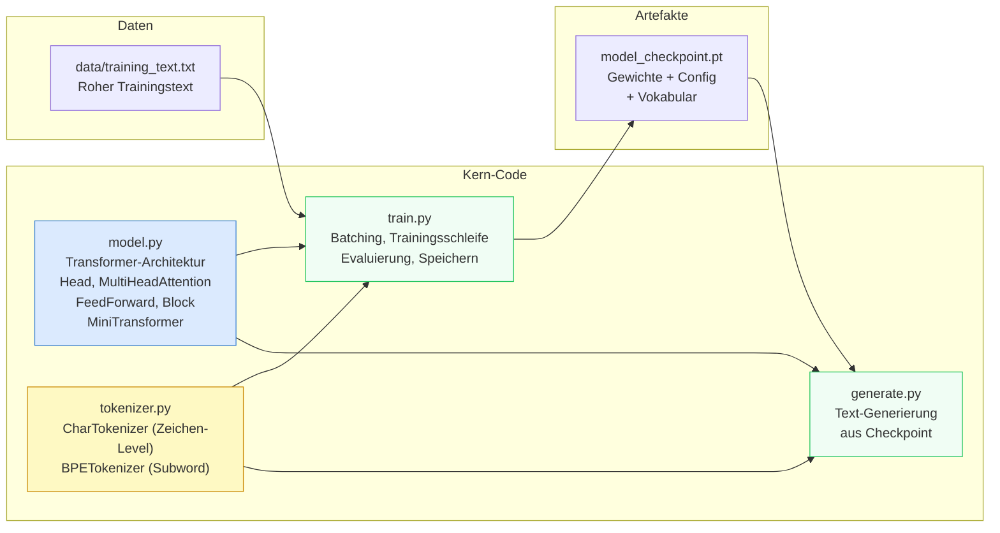

### Quellen und weiterführende Lektüre

- **Original Paper:** [Attention Is All You Need](https://arxiv.org/abs/1706.03762) (Vaswani et al., 2017)
- **GPT-Stil Decoder-Only:** [Language Models are Unsupervised Multitask Learners](https://cdn.openai.com/better-language-models/language_models_are_unsupervised_multitask_learners.pdf) (GPT-2, 2019)
- **BPE-Originalarbeit:** [Neural Machine Translation of Rare Words with Subword Units](https://arxiv.org/abs/1508.07909) (Sennrich et al., 2016)
- **Ausgezeichnete Video-Einführung:** Andrej Karpathys "Let's build GPT from scratch" (YouTube) – dieser Code folgt einem ähnlichen Ansatz
