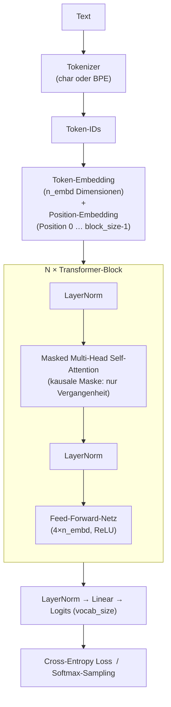

# Bedienungsanleitung: Mini-LLM Transformer

Diese Anleitung beschreibt, wie du das Projekt einrichtest, das Training startest, die Ausgabe interpretierst und mit den Hyperparametern experimentierst.

---

## Inhaltsverzeichnis

1. [Voraussetzungen](#1-voraussetzungen)
2. [Installation](#2-installation)
3. [Training starten](#3-training-starten)
4. [Ausgabe verstehen](#4-ausgabe-verstehen)
5. [Tokenizer: char vs. BPE](#5-tokenizer-char-vs-bpe)
6. [Hyperparameter anpassen](#6-hyperparameter-anpassen)
7. [Beobachtbare Lernphasen](#7-beobachtbare-lernphasen)
8. [Trainingsdaten erweitern](#8-trainingsdaten-erweitern)
9. [Modell-Checkpoint laden](#9-modell-checkpoint-laden)
10. [Architektur-Überblick](#10-architektur-überblick)
11. [Tipps für Experimente](#11-tipps-für-experimente)

---

## 1. Voraussetzungen

| Anforderung | Version |
|---|---|
| [uv](https://docs.astral.sh/uv/) | aktuell |
| Python | 3.10 – 3.12 (wird von uv automatisch installiert) |
| Betriebssystem | macOS Intel (x86_64), optimiert für CPU |

> **Hinweis:** Python 3.13 wird von PyTorch auf Intel-Mac noch nicht unterstützt. uv installiert automatisch die passende Version 3.12.

---

## 2. Installation

```bash
# In den Projektordner wechseln
cd /Users/andreaseidmann/Development/llm-mini-transformer

# Python 3.12 installieren (einmalig) und Abhängigkeiten auflösen
uv sync --python 3.12
```

uv legt dabei automatisch eine isolierte virtuelle Umgebung unter `.venv/` an und installiert:
- `torch 2.2.x` – Neural-Network-Framework
- `tqdm` – Fortschrittsanzeige

---

## 3. Training starten

```bash
uv run python train.py
```

Das Skript läuft vollständig auf der CPU. Eine typische Laufzeit auf einem Intel-Mac:

| `max_iters` | Ungefähre Dauer |
|---|---|
| 3 000 | ~5 Minuten |
| 5 000 | ~8–10 Minuten |

Nach Abschluss wird das Modell automatisch als `model_checkpoint.pt` gespeichert.

---

## 4. Ausgabe verstehen

Beim Start gibt das Skript eine Zusammenfassung der Konfiguration aus:

```
═════════════════════════════════════════════════════════════════
  Mini-Transformer – Lernexperiment
═════════════════════════════════════════════════════════════════
  Gerät          : cpu
  Zeichen gesamt : 5.306
  Vokabular-Größe: 68 eindeutige Zeichen
  ...
```

Alle `eval_interval` Iterationen erscheint ein Zwischen-Report:

```
─────────────────────────────────────────────────────────────────
  Iter   250/5000  ( 5.0%)  Zeit: 28s
  Train-Loss: 2.8134  |  Val-Loss: 2.9021  |  LR: 9.50e-04

  ▶ Generierter Text:
  'Der Wald ist ein wich...'
```

| Ausgabe | Bedeutung |
|---|---|
| `Train-Loss` | Fehler auf den Trainingsdaten – sollte sinken |
| `Val-Loss` | Fehler auf zurückgehaltenen Daten – zeigt Generalisierung |
| `LR` | Aktuelle Lernrate (sinkt bei aktivem Scheduler) |
| Generierter Text | Live-Probe, wie gut das Modell bereits schreibt |

> **Tipp:** Wenn `Val-Loss` deutlich größer als `Train-Loss` wird, passt sich das Modell zu stark an die Trainingsdaten an (Overfitting). Erhöhe dann `dropout`.

---

## 5. Tokenizer: char vs. BPE

Das Projekt unterstützt zwei Tokenisierungs-Strategien. Die Auswahl erfolgt in `train.py` über den `CONFIG`-Schlüssel `"tokenizer"`.

### Variante 1 – Zeichen-Level (`"char"`)

Jedes einzelne Zeichen im Text bekommt eine eigene Token-ID. Das Vokabular entspricht genau der Menge aller eindeutigen Zeichen im Trainingstext (typisch: 60–100 Tokens).

```python
"tokenizer":    "char",   # jedes Zeichen = ein Token
# bpe_vocab_size wird bei "char" ignoriert
```

| Eigenschaft | Wert |
|---|---|
| Vokabular-Größe | Anzahl eindeutiger Zeichen (~60–100) |
| Sequenzlänge | 1 Token pro Zeichen – sehr lange Sequenzen |
| Training | Sofort, kein Lernschritt nötig |
| Kontextfenster | Deckt wenige Wörter ab (je nach `block_size`) |
| Eignet sich für | Schnelle Experimente, sehr kurze Texte |

### Variante 2 – Byte Pair Encoding (`"bpe"`) ← Standard

Häufig gemeinsam auftretende Zeichen werden schrittweise zu Subword-Tokens zusammengefasst. Gebräuchliche Wörter erhalten ein eigenes Token, seltene Wörter werden in bekannte Teilstücke zerlegt.

```python
"tokenizer":     "bpe",   # Subword-Tokenizer (empfohlen)
"bpe_vocab_size": 2000,   # Ziel-Vokabulargröße (500–4000)
```

| Eigenschaft | Wert |
|---|---|
| Vokabular-Größe | Konfigurierbar via `bpe_vocab_size` (Standard: 2000) |
| Sequenzlänge | 1 Token ≈ 2–4 Zeichen → **kürzere** Sequenzen |
| Training | Einmaliger BPE-Lernschritt vor dem Modell-Training |
| Kontextfenster | Gleiche `block_size`, aber effektiv mehr Text abgedeckt |
| Eignet sich für | Alle Fälle mit ausreichend Trainingstext (≥ 5 000 Zeichen) |

### `bpe_vocab_size` – Richtwerte

| Wert | Textstärke | Effekt |
|---|---|---|
| `500` | kurze Texte (< 5 000 Zeichen) | kleines Vokabular, schnelles Training |
| `2000` | **Standard** (empfohlen) | guter Kompromiss aus Kompression und Abdeckung |
| `4000` | große Texte (> 50 000 Zeichen) | feinere Subwords, etwas langsamer |

> **Faustregel:** Pro ~200 Zeichen Trainingstext macht ein weiterer Merge-Schritt Sinn.
> Bei 10 000 Zeichen Text ist `bpe_vocab_size=500` bereits ausreichend, `2000` ist problemlos.

### Umschalten in `train.py`

```python
# In train.py, CONFIG-Block:

# BPE (Standard, empfohlen):
"tokenizer":     "bpe",
"bpe_vocab_size": 2000,

# Zeichen-Level (schnell, minimalistisch):
"tokenizer":    "char",
```

> **Wichtig:** Wenn du den Tokenizer-Modus änderst, muss das Modell **neu trainiert** werden.
> Ein mit BPE gespeicherter Checkpoint kann nicht mit dem Char-Tokenizer geladen werden – Checkpoint-Datei löschen oder umbenennen.

---

## 6. Hyperparameter anpassen

Öffne `train.py` und ändere die Werte im `CONFIG`-Dictionary ganz oben im Skript. Danach Training einfach neu starten.

### Kontextlänge: `block_size`

Wie viele Zeichen das Modell gleichzeitig als Kontext sieht.

| Wert | Effekt |
|---|---|
| `32` | Sehr schnell, kurzer Kontext – lernt nur kurze Muster |
| `64` | **Standard** – guter Kompromiss |
| `128` | Längerer Kontext, aber ~2× langsamer |

### Batch-Größe: `batch_size`

Wie viele Textausschnitte pro Trainingsschritt verarbeitet werden.

| Wert | Effekt |
|---|---|
| `16` | Wenig RAM, rauschigere Gradientupdates |
| `32` | **Standard** |
| `64` | Stabilere Updates, mehr Arbeitsspeicher nötig |

### Modell-Größe: `n_embd`, `n_heads`, `n_layers`

```python
"n_embd":   64,   # Embedding-Dimension (Breite des Modells)
"n_heads":  4,    # Attention-Heads — n_embd muss durch n_heads teilbar sein!
"n_layers": 4,    # Anzahl gestapelter Transformer-Blöcke (Tiefe)
```

> **Wichtig:** `n_embd` muss immer ohne Rest durch `n_heads` teilbar sein.  
> Beispiel: `n_embd=128` → `n_heads=8` ✓ | `n_heads=6` ✗

### Lernrate & Scheduler

```python
"learning_rate":    1e-3,   # Startwert; bei Plateau auf 5e-4 oder 1e-4 senken
"use_lr_scheduler": True,   # True → lineare Abnahme bis 10 % des Startwertes
```

### Zwischen-Generierung

```python
"eval_interval":   250,    # Alle X Iterationen: Loss + Textbeispiel ausgeben
"gen_start_text":  "Der",  # Startwort für den generierten Beispieltext
"gen_max_tokens":  120,    # Anzahl generierter Zeichen pro Zwischen-Report
"gen_temperature": 0.8,    # < 1.0 → konservativer | > 1.0 → kreativer/zufälliger
"gen_top_k":       40,     # Nur die k wahrscheinlichsten Kandidaten berücksichtigen
```

---

## 7. Beobachtbare Lernphasen

| Loss-Bereich | Was du im generierten Text siehst |
|---|---|
| ~4.2 | Reiner Buchstabensalat, keinerlei Muster |
| ~3.5 | Häufige Zeichen (`e`, `n`, Leerzeichen) häufen sich an |
| ~2.5 | Wortähnliche Strukturen, gelegentlich echte Wörter |
| ~2.0 | Kurze deutsche Wörter, einfache Wortfolgen |
| ~1.5 | Echte Wörter überwiegen, ansatzweise Grammatik sichtbar |

---

## 8. Trainingsdaten erweitern

Mehr deutschsprachiger Text in `data/training_text.txt` → weniger Overfitting → flüssiger generierter Text.
Empfehlung: mindestens 5.000 Zeichen, besser 20.000+. Das Vokabular (alle eindeutigen Zeichen) wird automatisch aus dem neuen Text ermittelt.

### Option A: Wikipedia-Artikel automatisch laden

Das Skript `fetch_wikipedia.py` lädt deutsche Wikipedia-Artikel per API, bereinigt den Text (Sonderzeichen, Wiki-Markup) und hängt ihn direkt an `data/training_text.txt` an.

```bash
# Artikel laden und anhängen (Standardfall)
uv run python fetch_wikipedia.py

# Nur anzeigen, nichts schreiben (Vorschau)
uv run python fetch_wikipedia.py --dry-run

# Mehr Text pro Artikel (Standard: 4000 Zeichen)
uv run python fetch_wikipedia.py --max-chars 8000

# Andere Zieldatei
uv run python fetch_wikipedia.py --output data/mein_text.txt
```

| Option | Standard | Beschreibung |
|---|---|---|
| `--output` | `data/training_text.txt` | Zieldatei |
| `--max-chars` | `4000` | Maximale Zeichen pro Artikel |
| `--dry-run` | aus | Nur anzeigen, nicht schreiben |

**Artikel-Liste anpassen:** Die Variable `ARTIKEL` am Anfang von `fetch_wikipedia.py` enthält die zu ladenden Artikel. Einfach ergänzen oder kürzen – deutsche Wikipedia-Titel, Leerzeichen als `_`.

```python
ARTIKEL = [
    "Elbe",
    "Schwarzwald",
    "Sonnensystem",
    # beliebig weitere Artikel ergänzen ...
]
```

> **Hinweis:** Umlaute im Titel müssen ggf. URL-kodiert werden (z. B. `ä` → `%C3%A4`). Die meisten Titel funktionieren aber auch direkt.

### Option B: Eigenen Text einfügen

```bash
# Text aus Zwischenablage anhängen (macOS)
pbpaste >> data/training_text.txt

# Oder direkt in einen Editor öffnen und Text einfügen
```

---

## 9. Modell nach dem Training verwenden

Nach dem Training wird `model_checkpoint.pt` gespeichert. Zur Textgenerierung gibt es das fertige Skript `generate.py`.

### Einfacher Start

```bash
uv run python generate.py
```

Verwendet den gespeicherten Checkpoint und startet mit dem Startwort `"Der"`.

### Optionen

```bash
uv run python generate.py --start "Die Wissenschaft"   # anderes Startwort
uv run python generate.py --tokens 500                 # mehr Zeichen generieren
uv run python generate.py --temperature 0.5            # fokussierter (weniger Zufall)
uv run python generate.py --temperature 1.2            # kreativer (mehr Zufall)
uv run python generate.py --top_k 10                   # nur Top-10 Kandidaten
```

### Alle Optionen im Überblick

| Option | Standard | Beschreibung |
|---|---|---|
| `--checkpoint` | `model_checkpoint.pt` | Pfad zum gespeicherten Checkpoint |
| `--start` | `"Der"` | Starttext für die Generierung |
| `--tokens` | `200` | Anzahl zu generierender Zeichen |
| `--temperature` | `0.8` | `< 1.0` fokussiert · `> 1.0` kreativ |
| `--top_k` | `40` | Nur die k wahrscheinlichsten Kandidaten |

### Kombination mehrerer Optionen

```bash
uv run python generate.py \
  --start "Der Wald ist" \
  --tokens 400 \
  --temperature 0.6 \
  --top_k 20
```

---

## 10. Architektur-Überblick



**Decoder-Only / Kausal:** Position `i` darf nur auf Positionen `0…i` schauen – nie in die Zukunft. Das ist die Grundeigenschaft von GPT-artigen Modellen.

| Datei | Inhalt |
|---|---|
| `model.py` | `Head`, `MultiHeadAttention`, `FeedForward`, `Block`, `MiniTransformer` |
| `tokenizer.py` | `CharTokenizer`, `BPETokenizer`, `build_tokenizer` – beide Tokenizer-Varianten |
| `train.py` | Datenlader, Trainings-Loop, Evaluierung, Generierung |

---

## 11. Tipps für Experimente

1. **Klein anfangen:** Setze `n_embd=32`, `n_layers=2` – beobachte die Ausgabe, dann skaliere schrittweise hoch.
2. **Overfitting erkennen:** `val_loss` wächst, während `train_loss` sinkt → `dropout` von `0.1` auf `0.2` erhöhen.
3. **Plateau überwinden:** Loss stagniert → `learning_rate` halbieren oder `use_lr_scheduler: True` setzen.
4. **Temperature erkunden:** Setze nach dem Training `gen_temperature` auf `0.2` (sehr fokussiert) bis `1.5` (sehr kreativ) und vergleiche die Texte.
5. **Mehr Daten:** Je mehr deutschsprachiger Text in `data/training_text.txt`, desto flüssiger wird der generierte Text. Nutze `fetch_wikipedia.py` um schnell weitere Artikel hinzuzufügen.
