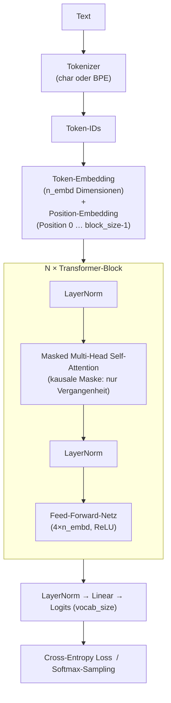

# Bedienungsanleitung: Mini-LLM Transformer

Diese Anleitung beschreibt, wie du das Projekt **lokal** einrichtest, das Training startest, die Ausgabe interpretierst und mit den Hyperparametern experimentierst.

> **Google Colab:** Wer das Projekt ohne lokale Installation direkt im Browser ausführen möchte, findet die entsprechende Schritt-für-Schritt-Anleitung in [COLAB.md](COLAB.md).

---

## Inhaltsverzeichnis

1. [Voraussetzungen](#1-voraussetzungen)
2. [Installation](#2-installation)
3. [Training starten](#3-training-starten)
4. [Ausgabe verstehen](#4-ausgabe-verstehen)
5. [Tokenizer: char vs. BPE](#5-tokenizer-char-vs-bpe)
6. [Hyperparameter anpassen](#6-hyperparameter-anpassen)
7. [Beobachtbare Lernphasen](#7-beobachtbare-lernphasen)
8. [Trainingsdaten erweitern](#8-trainingsdaten-erweitern)
9. [Modell-Checkpoint laden](#9-modell-checkpoint-laden)
10. [Architektur-Überblick](#10-architektur-überblick)
11. [Debuggen mit VS Code](#11-debuggen-mit-vs-code)
12. [Tipps für Experimente](#12-tipps-für-experimente)

---

## 1. Voraussetzungen

| Anforderung | Version |
|---|---|
| [uv](https://docs.astral.sh/uv/) | aktuell |
| Python | 3.10 – 3.12 (wird von uv automatisch installiert) |
| Betriebssystem | macOS Intel (x86_64), optimiert für CPU |

> **Hinweis:** Python 3.13 wird von PyTorch auf Intel-Mac noch nicht unterstützt. uv installiert automatisch die passende Version 3.12.

---

## 2. Installation

```bash
# In den Projektordner wechseln
cd /Users/andreaseidmann/Development/llm-mini-transformer

# Python 3.12 installieren (einmalig) und Abhängigkeiten auflösen
uv sync --python 3.12
```

uv legt dabei automatisch eine isolierte virtuelle Umgebung unter `.venv/` an und installiert:
- `torch 2.2.x` – Neural-Network-Framework
- `tqdm` – Fortschrittsanzeige

---

## 3. Training starten

`train.py` bietet zwei vorgefertigte **Modi** als Schnellkonfiguration. Alle weiteren Parameter können zusätzlich als Flags übergeben werden und übersteuern den Modus.

### Modi

| Modus | Befehl | Datei | Tokenizer | Modell | Iterationen |
|---|---|---|---|---|---|
| **simple** *(Standard)* | `uv run python train.py` | `training_text_simple.txt` | char | klein (32/4/2) | 1 000 |
| **advanced** | `uv run python train.py --mode advanced` | `training_text.txt` | BPE | mittel (96/6/4) | 6 000 |

```bash
# simple-Modus — kurzer Text, Zeichen-Tokenizer, kleines Modell (Standard)
uv run python train.py

# advanced-Modus — großer Text, BPE, Standard-Architektur
uv run python train.py --mode advanced

# Einzelne Parameter übersteuern (Modus bleibt als Basis)
uv run python train.py --max_iters 500
uv run python train.py --mode advanced --batch_size 64
uv run python train.py --mode simple --tokenizer bpe --bpe_vocab_size 300
```

Das Skript läuft vollständig auf der CPU. Typische Laufzeiten auf einem Intel-Mac:

| Modus | `max_iters` | Ungefähre Dauer |
|---|---|---|
| simple | 1 000 | ~1–2 Minuten |
| advanced | 3 000 | ~5 Minuten |
| advanced | 6 000 | ~10 Minuten |

Nach Abschluss wird das Modell automatisch als `model_checkpoint.pt` gespeichert.

### Alle verfügbaren Flags

```
--mode {simple,advanced}   Voreinstellung (Standard: simple)

-- Daten & Tokenizer --
--data_path PATH           Pfad zum Trainingstext
--tokenizer {char,bpe}     Tokenizer-Typ
--bpe_vocab_size N         BPE-Vokabular-Größe

-- Modell --
--block_size N             Kontext-Länge in Tokens
--n_embd N                 Embedding-Dimension
--n_heads N                Anzahl Attention-Heads
--n_layers N               Anzahl Transformer-Blöcke
--dropout F                Dropout-Rate

-- Training --
--batch_size N             Batch-Größe
--max_iters N              Maximale Iterationen
--learning_rate F          Lernrate
--use_lr_scheduler BOOL    Lernraten-Scheduler (true/false)
--eval_interval N          Evaluierungs-Intervall
--train_split F            Train-Anteil (0–1)
--seed N                   Zufalls-Seed

-- Generierung --
--gen_start_text TEXT      Starttext für Zwischen-Generierung
--gen_max_tokens N         Tokens pro Zwischen-Generierung
--gen_temperature F        Sampling-Temperatur
--gen_top_k N              Top-K (0 = deaktiviert)
```

---

## 4. Ausgabe verstehen

Beim Start gibt das Skript eine Zusammenfassung der Konfiguration aus:

```
═════════════════════════════════════════════════════════════════
  Mini-Transformer – Lernexperiment
═════════════════════════════════════════════════════════════════
  Gerät          : cpu
  Zeichen gesamt : 5.306
  Vokabular-Größe: 68 eindeutige Zeichen
  ...
```

Alle `eval_interval` Iterationen erscheint ein Zwischen-Report:

```
─────────────────────────────────────────────────────────────────
  Iter   250/5000  ( 5.0%)  Zeit: 28s
  Train-Loss: 2.8134  |  Val-Loss: 2.9021  |  LR: 9.50e-04

  ▶ Generierter Text:
  'Der Wald ist ein wich...'
```

| Ausgabe | Bedeutung |
|---|---|
| `Train-Loss` | Fehler auf den Trainingsdaten – sollte sinken |
| `Val-Loss` | Fehler auf zurückgehaltenen Daten – zeigt Generalisierung |
| `LR` | Aktuelle Lernrate (sinkt bei aktivem Scheduler) |
| Generierter Text | Live-Probe, wie gut das Modell bereits schreibt |

> **Tipp:** Wenn `Val-Loss` deutlich größer als `Train-Loss` wird, passt sich das Modell zu stark an die Trainingsdaten an (Overfitting). Erhöhe dann `dropout`.

---

## 5. Tokenizer: char vs. BPE

Das Projekt unterstützt zwei Tokenisierungs-Strategien. Die Auswahl erfolgt in `train.py` über den `CONFIG`-Schlüssel `"tokenizer"`.

### Variante 1 – Zeichen-Level (`"char"`)

Jedes einzelne Zeichen im Text bekommt eine eigene Token-ID. Das Vokabular entspricht genau der Menge aller eindeutigen Zeichen im Trainingstext (typisch: 60–100 Tokens).

```python
"tokenizer":    "char",   # jedes Zeichen = ein Token
# bpe_vocab_size wird bei "char" ignoriert
```

| Eigenschaft | Wert |
|---|---|
| Vokabular-Größe | Anzahl eindeutiger Zeichen (~60–100) |
| Sequenzlänge | 1 Token pro Zeichen – sehr lange Sequenzen |
| Training | Sofort, kein Lernschritt nötig |
| Kontextfenster | Deckt wenige Wörter ab (je nach `block_size`) |
| Eignet sich für | Schnelle Experimente, sehr kurze Texte |

### Variante 2 – Byte Pair Encoding (`"bpe"`) ← Standard

Häufig gemeinsam auftretende Zeichen werden schrittweise zu Subword-Tokens zusammengefasst. Gebräuchliche Wörter erhalten ein eigenes Token, seltene Wörter werden in bekannte Teilstücke zerlegt.

```python
"tokenizer":     "bpe",   # Subword-Tokenizer (empfohlen)
"bpe_vocab_size": 2000,   # Ziel-Vokabulargröße (500–4000)
```

| Eigenschaft | Wert |
|---|---|
| Vokabular-Größe | Konfigurierbar via `bpe_vocab_size` (Standard: 2000) |
| Sequenzlänge | 1 Token ≈ 2–4 Zeichen → **kürzere** Sequenzen |
| Training | Einmaliger BPE-Lernschritt vor dem Modell-Training |
| Kontextfenster | Gleiche `block_size`, aber effektiv mehr Text abgedeckt |
| Eignet sich für | Alle Fälle mit ausreichend Trainingstext (≥ 5 000 Zeichen) |

### `bpe_vocab_size` – Richtwerte

| Wert | Textstärke | Effekt |
|---|---|---|
| `500` | kurze Texte (< 5 000 Zeichen) | kleines Vokabular, schnelles Training |
| `2000` | **Standard** (empfohlen) | guter Kompromiss aus Kompression und Abdeckung |
| `4000` | große Texte (> 50 000 Zeichen) | feinere Subwords, etwas langsamer |

> **Faustregel:** Pro ~200 Zeichen Trainingstext macht ein weiterer Merge-Schritt Sinn.
> Bei 10 000 Zeichen Text ist `bpe_vocab_size=500` bereits ausreichend, `2000` ist problemlos.

### Umschalten per CLI

```bash
# Zeichen-Level (entspricht dem simple-Modus):
uv run python train.py --tokenizer char

# BPE (entspricht dem advanced-Modus):
uv run python train.py --tokenizer bpe --bpe_vocab_size 2000
```

> **Wichtig:** Wenn du den Tokenizer-Typ änderst, muss das Modell **neu trainiert** werden.
> Ein mit BPE gespeicherter Checkpoint kann nicht mit dem Char-Tokenizer geladen werden – Checkpoint-Datei löschen oder umbenennen.

---

## 6. Hyperparameter anpassen

Alle Parameter können als CLI-Flags übergeben werden und übersteuern die Modus-Voreinstellung:

```bash
uv run python train.py --block_size 128 --n_embd 64 --n_heads 4
```

### Kontextlänge: `block_size`

Wie viele Zeichen das Modell gleichzeitig als Kontext sieht.

| Wert | Effekt |
|---|---|
| `32` | Sehr schnell, kurzer Kontext – lernt nur kurze Muster |
| `64` | **Standard** – guter Kompromiss |
| `128` | Längerer Kontext, aber ~2× langsamer |

### Batch-Größe: `batch_size`

Wie viele Textausschnitte pro Trainingsschritt verarbeitet werden.

| Wert | Effekt |
|---|---|
| `16` | Wenig RAM, rauschigere Gradientupdates |
| `32` | **Standard** |
| `64` | Stabilere Updates, mehr Arbeitsspeicher nötig |

### Modell-Größe: `n_embd`, `n_heads`, `n_layers`

```python
"n_embd":   64,   # Embedding-Dimension (Breite des Modells)
"n_heads":  4,    # Attention-Heads — n_embd muss durch n_heads teilbar sein!
"n_layers": 4,    # Anzahl gestapelter Transformer-Blöcke (Tiefe)
```

> **Wichtig:** `n_embd` muss immer ohne Rest durch `n_heads` teilbar sein.  
> Beispiel: `n_embd=128` → `n_heads=8` ✓ | `n_heads=6` ✗

### Lernrate & Scheduler

```python
"learning_rate":    1e-3,   # Startwert; bei Plateau auf 5e-4 oder 1e-4 senken
"use_lr_scheduler": True,   # True → lineare Abnahme bis 10 % des Startwertes
```

### Zwischen-Generierung

```bash
uv run python train.py \
  --eval_interval 250 \
  --gen_start_text "Der" \
  --gen_max_tokens 120 \
  --gen_temperature 0.8 \
  --gen_top_k 40
```

---

## 7. Beobachtbare Lernphasen

| Loss-Bereich | Was du im generierten Text siehst |
|---|---|
| ~4.2 | Reiner Buchstabensalat, keinerlei Muster |
| ~3.5 | Häufige Zeichen (`e`, `n`, Leerzeichen) häufen sich an |
| ~2.5 | Wortähnliche Strukturen, gelegentlich echte Wörter |
| ~2.0 | Kurze deutsche Wörter, einfache Wortfolgen |
| ~1.5 | Echte Wörter überwiegen, ansatzweise Grammatik sichtbar |

---

## 8. Trainingsdaten erweitern

Mehr deutschsprachiger Text in `data/training_text.txt` → weniger Overfitting → flüssiger generierter Text.
Empfehlung: mindestens 5.000 Zeichen, besser 20.000+. Das Vokabular (alle eindeutigen Zeichen) wird automatisch aus dem neuen Text ermittelt.

### Option A: Wikipedia-Artikel automatisch laden

Das Skript `fetch_wikipedia.py` lädt deutsche Wikipedia-Artikel per API, bereinigt den Text (Sonderzeichen, Wiki-Markup) und hängt ihn direkt an `data/training_text.txt` an.

```bash
# Artikel laden und anhängen (Standardfall)
uv run python fetch_wikipedia.py

# Nur anzeigen, nichts schreiben (Vorschau)
uv run python fetch_wikipedia.py --dry-run

# Mehr Text pro Artikel (Standard: 4000 Zeichen)
uv run python fetch_wikipedia.py --max-chars 8000

# Andere Zieldatei
uv run python fetch_wikipedia.py --output data/mein_text.txt
```

| Option | Standard | Beschreibung |
|---|---|---|
| `--output` | `data/training_text.txt` | Zieldatei |
| `--max-chars` | `4000` | Maximale Zeichen pro Artikel |
| `--dry-run` | aus | Nur anzeigen, nicht schreiben |

**Artikel-Liste anpassen:** Die Variable `ARTIKEL` am Anfang von `fetch_wikipedia.py` enthält die zu ladenden Artikel. Einfach ergänzen oder kürzen – deutsche Wikipedia-Titel, Leerzeichen als `_`.

```python
ARTIKEL = [
    "Elbe",
    "Schwarzwald",
    "Sonnensystem",
    # beliebig weitere Artikel ergänzen ...
]
```

> **Hinweis:** Umlaute im Titel müssen ggf. URL-kodiert werden (z. B. `ä` → `%C3%A4`). Die meisten Titel funktionieren aber auch direkt.

### Option B: Eigenen Text einfügen

```bash
# Text aus Zwischenablage anhängen (macOS)
pbpaste >> data/training_text.txt

# Oder direkt in einen Editor öffnen und Text einfügen
```

---

## 9. Modell nach dem Training verwenden

Nach dem Training wird `model_checkpoint.pt` gespeichert. Zur Textgenerierung gibt es das fertige Skript `generate.py`.

### Einfacher Start

```bash
uv run python generate.py
```

Verwendet den gespeicherten Checkpoint und startet mit dem Startwort `"Der"`.

### Optionen

```bash
uv run python generate.py --start "Die Wissenschaft"   # anderes Startwort
uv run python generate.py --tokens 500                 # mehr Zeichen generieren
uv run python generate.py --temperature 0.5            # fokussierter (weniger Zufall)
uv run python generate.py --temperature 1.2            # kreativer (mehr Zufall)
uv run python generate.py --top_k 10                   # nur Top-10 Kandidaten
```

### Alle Optionen im Überblick

| Option | Standard | Beschreibung |
|---|---|---|
| `--checkpoint` | `model_checkpoint.pt` | Pfad zum gespeicherten Checkpoint |
| `--start` | `"Der"` | Starttext für die Generierung |
| `--tokens` | `200` | Anzahl zu generierender Zeichen |
| `--temperature` | `0.8` | `< 1.0` fokussiert · `> 1.0` kreativ |
| `--top_k` | `40` | Nur die k wahrscheinlichsten Kandidaten |

### Kombination mehrerer Optionen

```bash
uv run python generate.py \
  --start "Der Wald ist" \
  --tokens 400 \
  --temperature 0.6 \
  --top_k 20
```

---

## 10. Architektur-Überblick



**Decoder-Only / Kausal:** Position `i` darf nur auf Positionen `0…i` schauen – nie in die Zukunft. Das ist die Grundeigenschaft von GPT-artigen Modellen.

| Datei | Inhalt |
|---|---|
| `model.py` | `Head`, `MultiHeadAttention`, `FeedForward`, `Block`, `MiniTransformer` |
| `tokenizer.py` | `CharTokenizer`, `BPETokenizer`, `build_tokenizer` – beide Tokenizer-Varianten |
| `train.py` | Datenlader, Trainings-Loop, Evaluierung, Generierung |

---

## 11. Debuggen mit VS Code

Das Projekt enthält eine fertige Debug-Konfiguration unter `.vscode/launch.json`. Damit lässt sich `train.py` direkt aus VS Code heraus Schritt für Schritt durchlaufen — ohne `uv run`.

### Starten

1. Sidebar-Icon **Run and Debug** öffnen (⌘+Shift+D)
2. Konfiguration aus dem Dropdown wählen:

| Konfiguration | Wann sinnvoll |
|---|---|
| `train.py – simple (debug)` | Standardfall — kleiner Datensatz, läuft schnell durch |
| `train.py – advanced (debug)` | Vollständiger Lauf mit BPE und großem Datensatz |
| `train.py – custom args (debug)` | Nur 200 Iterationen — ideal zum Durchsteppen einzelner Schritte |

3. **F5** drücken — der Debugger hält am ersten gesetzten Breakpoint an

> **Hinweis:** Der Interpreter ist `.venv/bin/python` — dasselbe Python mit denselben Paketen wie bei `uv run python train.py`. Kein Unterschied im Ergebnis, nur der Debugger ist eingehängt.

### Empfohlene Breakpoints

Setze rote Punkte (Klick links neben die Zeilennummer) an diesen Stellen:

| Datei | Zeile | Was du dort siehst |
|---|---|---|
| `train.py` | 354 | Beginn der Trainings-Schleife — `iteration` zählt von 1 an |
| `train.py` | 392–393 | Einen Batch laden + Forward Pass — `x`, `y`, `loss` inspizieren |
| `train.py` | 395–399 | Backward Pass + Optimizer-Schritt — Gradienten vor/nach `step()` |
| `model.py` | 184–186 | Token- + Positions-Embedding — Form `(B, T, n_embd)` |
| `model.py` | 46–57 | `Head.forward` — `k`, `q`, `wei` (Attention-Gewichte) nach Softmax |
| `model.py` | 122–125 | `Block.forward` — Residual-Verbindung live beobachten |
| `model.py` | 189–195 | `MiniTransformer.forward` — `logits` und skalaren `loss` prüfen |

### Nützliche Debugger-Ausdrücke im Watch-Panel

```
loss.item()                              # aktueller Loss als Zahl
x.shape                                  # Batch-Form, z.B. torch.Size([16, 64])
model.token_embedding.weight.grad        # Gradient des Embedding nach backward()
logits[0, -1].topk(5)                   # Top-5 Kandidaten für das nächste Token
optimizer.param_groups[0]['lr']          # aktuelle Lernrate
```

### Shortcuts

| Taste | Aktion |
|---|---|
| **F10** | Step Over — nächste Zeile |
| **F11** | Step Into — in Funktion springen (z. B. `model.forward`) |
| **Shift+F11** | Step Out — aus Funktion heraus |
| **F5** | Continue — bis zum nächsten Breakpoint |
| **F9** | Breakpoint an/aus |

---

## 12. Tipps für Experimente

1. **Mit `simple` starten:** Der simple-Modus ist bewusst schnell — ideal zum ersten Ausprobieren. Dann mit `--mode advanced` auf den größeren Datensatz wechseln.
2. **Klein anfangen:** `uv run python train.py --n_embd 32 --n_layers 2` – beobachte die Ausgabe, dann skaliere schrittweise hoch.
3. **Overfitting erkennen:** `val_loss` wächst, während `train_loss` sinkt → `--dropout 0.2` setzen.
4. **Plateau überwinden:** Loss stagniert → `--learning_rate 5e-4` oder `--use_lr_scheduler true`.
5. **Temperature erkunden:** `uv run python generate.py --temperature 0.2` (sehr fokussiert) bis `--temperature 1.5` (sehr kreativ) und Texte vergleichen.
6. **Mehr Daten:** Je mehr Text in `data/training_text.txt`, desto flüssiger wird der generierte Text. Nutze `fetch_wikipedia.py` und starte dann mit `--mode advanced`.
