# Architecture: Mini-LLM Decoder-Only Transformer

> A detailed explanation for those with little prior experience in LLM programming.  
> Goal: Every line of code should be understood – not just *what* it does, but *why*.

---

## Table of Contents

1. [The Big Picture – What Does a Language Model Actually Do?](#1-the-big-picture)
2. [From Text to Numbers – Tokenisation and Embedding](#2-from-text-to-numbers)
   - [2.1 Character-Level Tokenizer](#21-character-level-tokenizer)
   - [2.2 BPE Tokenizer (Byte Pair Encoding)](#22-bpe-tokenizer-byte-pair-encoding)
   - [2.3 Token Embedding](#23-token-embedding)
   - [2.4 Positional Embedding](#24-positional-embedding)
3. [The Attention Mechanism – How Tokens "Talk to Each Other"](#3-the-attention-mechanism)
4. [Multi-Head Attention – Multiple Perspectives at Once](#4-multi-head-attention)
5. [Feed-Forward Network – Non-linear Transformation](#5-feed-forward-network)
6. [The Complete Transformer Block](#6-the-complete-transformer-block)
7. [The Complete Model – MiniTransformer](#7-the-complete-model)
8. [Training – How Does the Model Learn?](#8-training)
9. [Text Generation – Temperature and Top-k](#9-text-generation)
10. [Hyperparameters and Their Effects](#10-hyperparameters-and-their-effects)
11. [File Overview](#11-file-overview)

---

## 1. The Big Picture

A **language model** learns to predict the next most probable token (here: the next character), given all previous characters. This sounds simple, but leads to surprisingly good results.

```
Input:  "Der Hund b"
Task:   What comes next? → "e" (from "bellt") or "i" (from "bissig") or ...
Output: Probability over all known characters
```

This mini-transformer is a **Decoder-Only** model (like GPT). "Decoder-Only" means: there is only the part that generates text – no separate encoder that processes a different language or context. It always sees only the previous tokens, never the future ones.

### Overall Architecture at a Glance

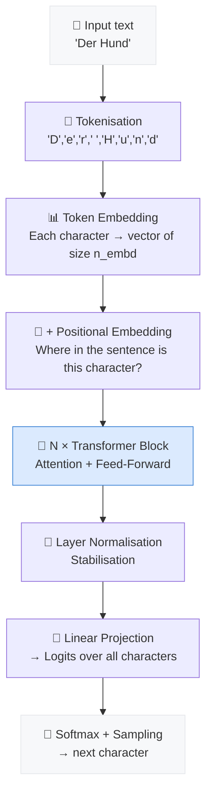

---

## 2. From Text to Numbers

Neural networks work with numbers, not text. The first step is therefore **tokenisation**: text is converted into a sequence of integers (token IDs). The project offers two tokeniser implementations in [`tokenizer.py`](tokenizer.py), selectable via the `--tokenizer` parameter in [`train.py`](train.py).

### 2.1 Character-Level Tokenizer

The [`CharTokenizer`](tokenizer.py:61) is the simplest possible approach: **each character = one token**.

```python
# Collect and sort all unique characters in the training text
chars = sorted(set(text))          # e.g. [' ', '!', 'A', 'B', ..., 'z']
stoi  = {ch: i for i, ch in enumerate(chars)}   # str → int  ("A" → 12)
itos  = {i: ch for i, ch in enumerate(chars)}   # int → str  (12 → "A")
```

> **Example:** `"Hund"` → `[23, 44, 31, 12]`
> The exact numbers depend on the training text.

**Advantages:**
- Extremely simple, no training step required
- Small vocabulary (number of unique characters, typically 60–150)
- Can encode any character sequence – no unknown tokens

**Disadvantages:**
- The model must learn words **character by character**
- Long sequences: `"Transformer"` takes up 11 tokens instead of 1–3
- The limited context window (`block_size`) is consumed by individual characters

---

### 2.2 BPE Tokenizer (Byte Pair Encoding)

The [`BPETokenizer`](tokenizer.py:98) is the industry standard (used by GPT-2, GPT-4, LLaMA, etc.). It learns **subword tokens** from the training text: frequent character combinations are merged into a single token.

#### The Algorithm in Three Steps

```
Starting point: character sequence  →  "d", "i", "e", " ", "K", "a", "t", "z", "e"

Step 1 – Initial vocabulary:  all unique characters   (like CharTokenizer)
Step 2 – Most frequent pair:  ("K","a") appears 847 times → new token "Ka"
Step 3 – Replace:             "Ka", "t", "z", "e"
             → continue until vocab_size is reached
```

The implementation in [`BPETokenizer.train()`](tokenizer.py:131) works **word-based** for efficiency: instead of maintaining the entire text as a flat character sequence, word frequencies are counted first and merges are applied to these compact word representations. This reduces complexity from O(`vocab_size × total_chars`) to O(`vocab_size × unique_words`).

```python
# Simplified example from BPETokenizer.train():
while len(stoi) < vocab_size:
    pair_counts = get_pair_counts(word_freq)          # find most frequent pair
    best = max(pair_counts, key=pair_counts.get)      # e.g. ("t", "h") → "th"
    stoi["th"] = new_id                               # add to vocabulary
    merges.append(best)                               # remember merge order
    word_freq = apply_merge(word_freq, best)          # update all words
```

When **encoding**, the same merges are applied in the same order to the text (see [`BPETokenizer.encode()`](tokenizer.py:222)).

**Advantages:**
- **Compresses** sequences strongly: `"der"` → 1 token instead of 3
- Common words get their own tokens; rare words are split into known subwords
- The context window uses semantically richer units
- Typical compression ratio: 3–5× compared to character level

**Disadvantages:**
- Requires a **training step** (takes a few seconds to minutes)
- Vocabulary and merges must be saved alongside the model
- Slightly more complex implementation

#### Visual Comparison: The Same Word with Both Tokenizers

```
Text:  "Transformer"

CharTokenizer  →  11 tokens:  ["T","r","a","n","s","f","o","r","m","e","r"]

BPETokenizer   →   3 tokens:  ["Trans","form","er"]
(with vocab_size=2000, after training on German Wikipedia text)
```

#### Side-by-Side Comparison

| Property              | CharTokenizer            | BPETokenizer                    |
|-----------------------|--------------------------|---------------------------------|
| Vocabulary size       | ~60–150 (fixed)          | configurable (default: 2000)    |
| Training step         | none                     | yes (a few seconds–minutes)     |
| Tokens per word       | many (1 per character)   | few (1–3 subwords)              |
| Context utilisation   | inefficient              | efficient                       |
| Unknown characters    | are skipped              | are skipped                     |
| Suitable for          | experiments, debugging   | realistic training              |
| Activation            | `--tokenizer char`       | `--tokenizer bpe` (default)     |

---

### 2.3 Token Embedding

An embedding is a **lookup table**: for each of the `vocab_size` token types there is a learnable vector of size `n_embd`.

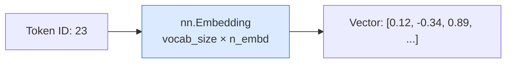

```python
# In model.py, MiniTransformer.__init__:
self.token_embedding = nn.Embedding(vocab_size, n_embd)
```

At the start of training these vectors are random. Through training the model learns to represent similar characters/patterns with similar vectors.

### 2.4 Positional Embedding

Attention operations are inherently **position-agnostic** – `q @ k.T` produces the same result regardless of whether token A comes before or after token B. To preserve the order of characters, an additional **positional embedding** is added:

```python
# In model.py, MiniTransformer.forward:
tok_emb = self.token_embedding(idx)                              # (B, T, n_embd)
pos_emb = self.position_embedding(torch.arange(T, device=...))  # (T, n_embd)
x = tok_emb + pos_emb   # positions "woven in"
```

For each of the `block_size` possible positions (0 to 127) there is its own learnable vector. This allows the model to learn what it means to be at the first, second, ... position.

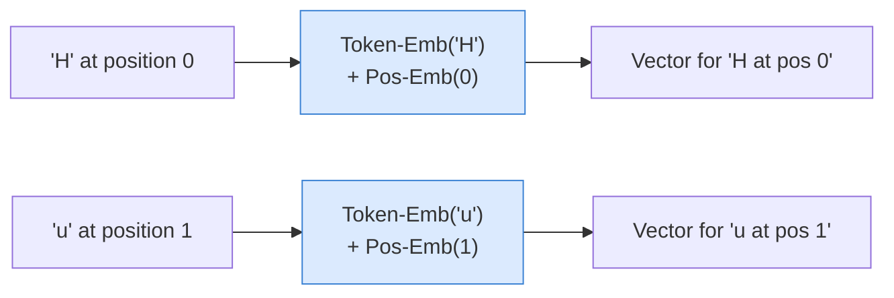

---

## 3. The Attention Mechanism

This is the **core of the Transformer**. The attention mechanism decides for each position: *Which other positions in the context are relevant to me?*

Implemented in the class [`Head`](model.py:27).

### 3.1 Query, Key, Value

Each input vector is transformed into three roles via three separate linear projections:

| Role | Analogy | Meaning |
|---|---|---|
| **Query (Q)** | "What am I looking for?" | The current position asks which other tokens are important for it |
| **Key (K)** | "What do I offer?" | Each position advertises what information it contains |
| **Value (V)** | "What do I pass on?" | The actual information handed over when there is a match |

```python
# In model.py, Head.__init__:
self.key   = nn.Linear(n_embd, head_size, bias=False)
self.query = nn.Linear(n_embd, head_size, bias=False)
self.value = nn.Linear(n_embd, head_size, bias=False)
```

### 3.2 Scaled Dot-Product Attention

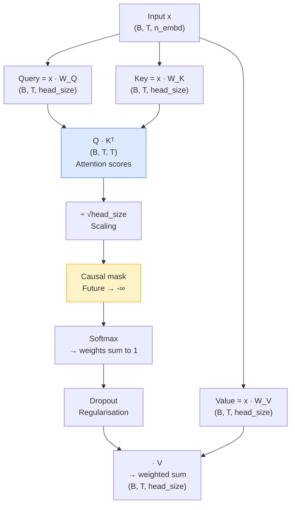

**Step by step in code** ([`Head.forward()`](model.py:44)):

```python
def forward(self, x):
    B, T, C = x.shape          # batch size, time steps, channels

    k = self.key(x)            # (B, T, head_size)
    q = self.query(x)          # (B, T, head_size)
    head_size = k.shape[-1]

    # 1) Scores: how well does each query match each key?
    wei = q @ k.transpose(-2, -1) * (head_size ** -0.5)   # (B, T, T)
    #                                  ↑ scaling: without it the values become
    #                                    too large and softmax saturates

    # 2) Causal mask: position i may only see positions 0..i
    wei = wei.masked_fill(self.tril[:T, :T] == 0, float("-inf"))
    
    # 3) Softmax: scores → weights (sum to 1)
    wei = F.softmax(wei, dim=-1)
    wei = self.dropout(wei)

    # 4) Weighted sum of values
    v = self.value(x)          # (B, T, head_size)
    return wei @ v             # (B, T, head_size)
```

### 3.3 Why the Causal Mask?

During **training** we know the entire text. But the model should learn to predict the next token – so it must not "cheat" by looking ahead at the target.

```
Position:  0    1    2    3    4
Character: D    e    r    _    H

Position 2 ('r') may see:      D, e, r       ✓
Position 2 ('r') must NOT see: _, H          ✗  → set to -∞
```

The lower triangular matrix `tril` implements exactly this:

```
tril (4×4):
[[1, 0, 0, 0],
 [1, 1, 0, 0],
 [1, 1, 1, 0],
 [1, 1, 1, 1]]
```

Where a `0` appears, the attention score is set to `-∞`. After softmax, `-∞` becomes `0` – these positions are completely ignored.

---

## 4. Multi-Head Attention

A single attention head can only learn one "perspective". With **Multi-Head Attention**, multiple heads run **in parallel** – each can learn different aspects of the relationships (e.g. grammatical dependencies, semantic proximity, sentence structure).

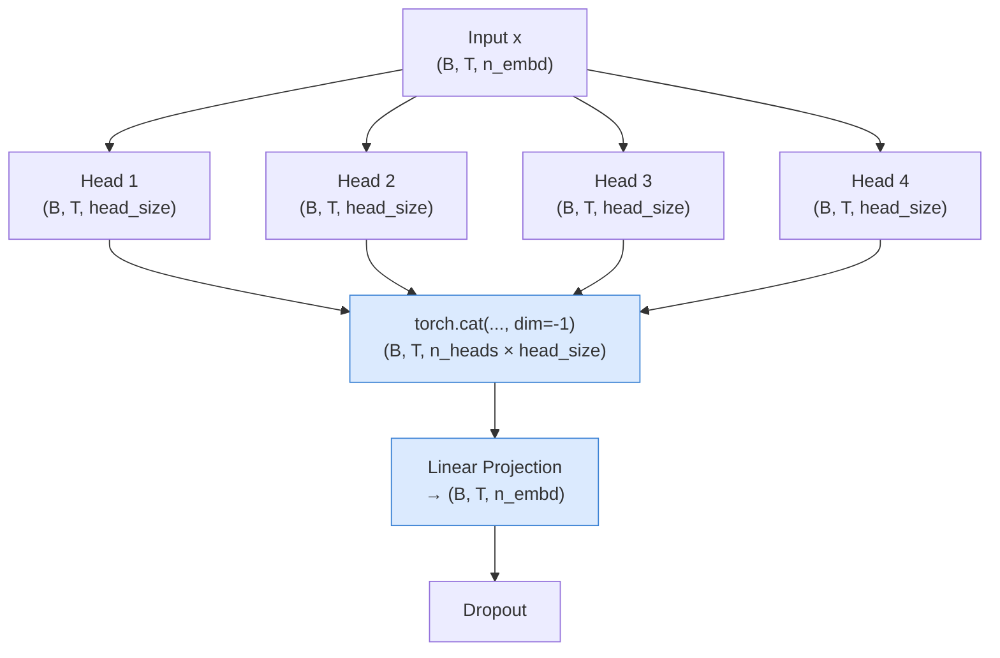

```python
# In model.py, MultiHeadAttention:
class MultiHeadAttention(nn.Module):
    def __init__(self, n_heads, head_size, n_embd, block_size, dropout):
        self.heads = nn.ModuleList([
            Head(head_size, n_embd, block_size, dropout) for _ in range(n_heads)
        ])
        self.proj    = nn.Linear(n_heads * head_size, n_embd)  # project back to n_embd
        self.dropout = nn.Dropout(dropout)

    def forward(self, x):
        out = torch.cat([h(x) for h in self.heads], dim=-1)   # concatenate all heads
        return self.dropout(self.proj(out))                    # project + dropout
```

> **Tip:** `head_size = n_embd // n_heads`. With `n_embd=64` and `n_heads=4`, `head_size=16`. The total width therefore stays constant – it is just a different partitioning of the capacity.

---

## 5. Feed-Forward Network

After attention, a simple **2-layer MLP** (Multi-Layer Perceptron) follows that works **position-wise** – i.e. each position in the context is transformed independently of the others.

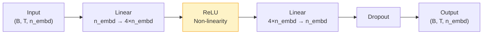

```python
# In model.py, FeedForward:
self.net = nn.Sequential(
    nn.Linear(n_embd, 4 * n_embd),   # expansion: 4× wider (classic GPT scaling)
    nn.ReLU(),                         # non-linearity (GPT-2/3 uses GELU, here ReLU)
    nn.Linear(4 * n_embd, n_embd),    # projection back to n_embd
    nn.Dropout(dropout),
)
```

**Why 4×?** This is an empirically proven heuristic from the original Transformer paper. The expansion allows the network to learn more complex transformations before compressing back to the model dimension.

**Why is the FFN needed at all?** Attention alone is a weighted sum – a linear operation. ReLU adds non-linearity, without which the model could not approximate complex functions.

---

## 6. The Complete Transformer Block

Attention and FFN are combined in a **block**, with two important additions: **LayerNorm** and **residual connections**.

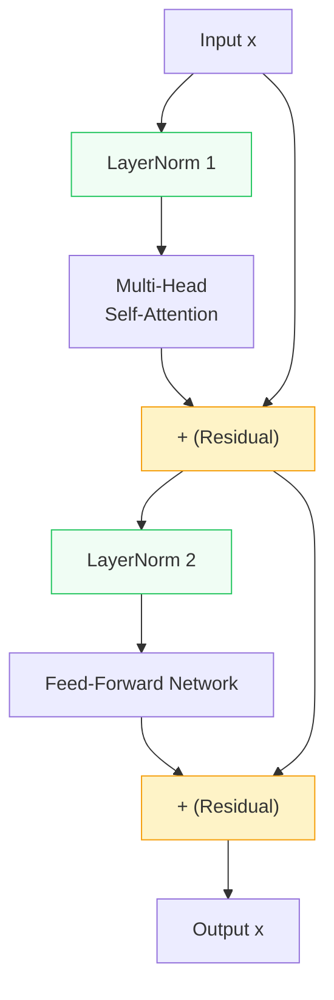

```python
# In model.py, Block.forward:
def forward(self, x):
    x = x + self.sa(self.ln1(x))   # residual around attention
    x = x + self.ff(self.ln2(x))   # residual around FFN
    return x
```

### 6.1 Why Residual Connections?

**Problem without residuals:** In deep networks (many layers), gradients vanish during backpropagation (*vanishing gradients*). The early layers receive almost no learning signal.

**Solution:** `x = x + f(x)` – the input is added directly to the output. This creates a "shortcut" through which gradients can flow directly backwards. In the worst case the model learns `f(x) = 0` and the layer is bypassed.

### 6.2 Why Layer Normalisation?

LayerNorm normalises the activations within each token to mean 0 and standard deviation 1. This stabilises training because extreme values (very large or very small) destabilise the gradients.

**Pre-LayerNorm** is used here (`ln` *before* Attention/FFN), which is more modern and stable than the original Post-Norm scheme of the Attention-Is-All-You-Need paper.

---

## 7. The Complete Model

The class [`MiniTransformer`](model.py:131) combines all components:

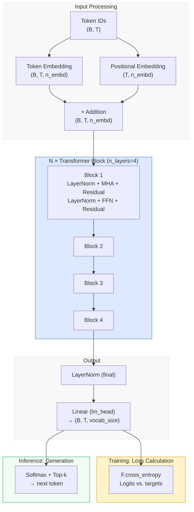

### 7.1 Parameter Initialisation

```python
# In model.py, MiniTransformer._init_weights:
@staticmethod
def _init_weights(module):
    if isinstance(module, nn.Linear):
        nn.init.normal_(module.weight, mean=0.0, std=0.02)
```

All linear weights are initialised with a small normal distribution (σ=0.02). This is important: too large initial values lead to instability in training, too small values mean gradients vanish early on.

### 7.2 Forward Pass

```python
def forward(self, idx, targets=None):
    B, T = idx.shape
    tok_emb = self.token_embedding(idx)                              # (B, T, n_embd)
    pos_emb = self.position_embedding(torch.arange(T, device=...))  # (T, n_embd)
    x = tok_emb + pos_emb

    x = self.blocks(x)         # through all N transformer blocks
    x = self.ln_final(x)       # final normalisation
    logits = self.lm_head(x)   # (B, T, vocab_size)  ← raw scores for each character

    loss = None
    if targets is not None:
        B, T, V = logits.shape
        # Cross-entropy: how far does the prediction deviate from the actual next character?
        loss = F.cross_entropy(logits.view(B * T, V), targets.view(B * T))

    return logits, loss
```

---

## 8. Training

Training is implemented in [`train.py`](train.py). The goal: adjust the model weights so that the loss (prediction error) decreases.

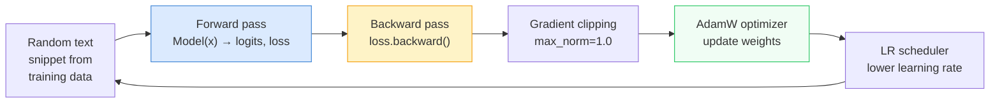

### 8.1 Batching

```python
# In train.py, get_batch:
ix = torch.randint(len(data) - block_size, (batch_size,))
x  = torch.stack([data[i     : i + block_size    ] for i in ix])
y  = torch.stack([data[i + 1 : i + block_size + 1] for i in ix])
```

A **batch** consists of `batch_size` random snippets of length `block_size` from the training text. `y` is shifted exactly one character relative to `x` – this is the learning target: for each position in `x` the model should predict the corresponding character in `y`.

```
x: [ D, e, r, _, H, u, n ]
y: [ e, r, _, H, u, n, d ]
         ↑ always the next character
```

### 8.2 Loss: Cross-Entropy

**Cross-entropy** measures how wrong the predictions are. If the model assigns a high probability to the correct next character, the loss is low; with uniform or wrong predictions it is high.

> **Rule of thumb:** `loss = ln(vocab_size)` is the loss when guessing randomly. For a vocabulary of ~70 characters: `ln(70) ≈ 4.25`. A trained model should be well below this.

### 8.3 AdamW Optimizer

```python
optimizer = torch.optim.AdamW(model.parameters(), lr=cfg["learning_rate"])
```

AdamW is a variant of Adam (Adaptive Moment Estimation) that implements weight decay correctly. It adapts the learning rate for each parameter individually – parameters that are updated rarely receive larger steps.

### 8.4 Gradient Clipping

```python
torch.nn.utils.clip_grad_norm_(model.parameters(), max_norm=1.0)
```

When gradients become very large (*exploding gradients*), a single update step can destabilise the model. Gradient clipping limits the norm of the total gradient to `max_norm=1.0`.

### 8.5 Learning Rate Scheduler

```python
scheduler = torch.optim.lr_scheduler.LinearLR(
    optimizer, start_factor=1.0, end_factor=0.1, total_iters=cfg["max_iters"]
)
```

At the beginning the model learns quickly (high learning rate). Towards the end it should make fine adjustments (low learning rate). The scheduler linearly decreases the learning rate from 100% to 10% of the start value.

---

## 9. Text Generation

After training the model can generate text autoregressively – token by token:

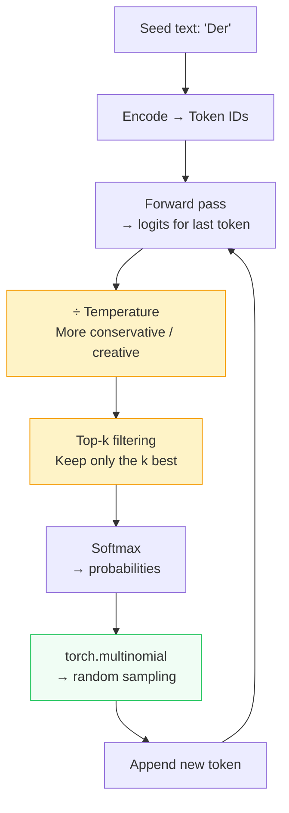

```python
# In model.py, MiniTransformer.generate:
for _ in range(max_new_tokens):
    idx_cond = idx[:, -self.block_size:]            # limit context
    logits, _ = self(idx_cond)
    logits = logits[:, -1, :] / temperature         # last token only, apply temperature

    if top_k is not None:
        v, _ = torch.topk(logits, min(top_k, logits.size(-1)))
        logits[logits < v[:, [-1]]] = float("-inf") # everything outside top-k → -∞

    probs    = F.softmax(logits, dim=-1)
    idx_next = torch.multinomial(probs, num_samples=1)  # random sampling
    idx      = torch.cat([idx, idx_next], dim=1)        # append new token
```

### 9.1 Temperature

| Temperature | Effect | When to use |
|---|---|---|
| `0.2 – 0.5` | Conservative, repetitive | When coherence matters |
| `0.8` | Good balance (default) | Most cases |
| `1.0` | Original distribution | Neutral sampling |
| `1.2 – 2.0` | Creative, chaotic | Experimenting |

### 9.2 Top-k Sampling

Without top-k the model could sample very unlikely tokens. With `top_k=40` all but the 40 most probable candidates are set to `−∞` (→ probability 0). This significantly improves quality.

---

## 10. Hyperparameters and Their Effects

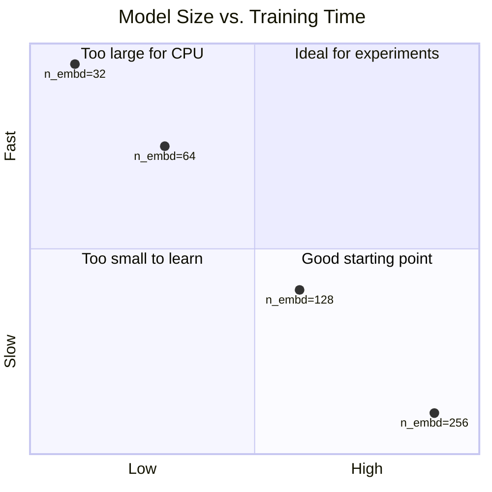

| Parameter | Default | Small | Large | Effect |
|---|---|---|---|---|
| `n_embd` | 64 | 32 | 256 | Model width, affects all layers |
| `n_heads` | 4 | 2 | 8 | More perspectives in attention |
| `n_layers` | 4 | 1 | 6 | Depth – more levels of abstraction |
| `block_size` | 128 | 32 | 256 | Context window – how far back the model looks |
| `dropout` | 0.2 | 0.0 | 0.4 | Regularisation – prevents overfitting |
| `learning_rate` | 1e-3 | 1e-4 | 5e-3 | Step size during learning |
| `batch_size` | 32 | 16 | 64 | Number of parallel training examples |

**Important constraints:**
- `n_embd` must be divisible by `n_heads` (`head_size = n_embd // n_heads`)
- Larger models require more RAM and longer training

---

## 11. File Overview

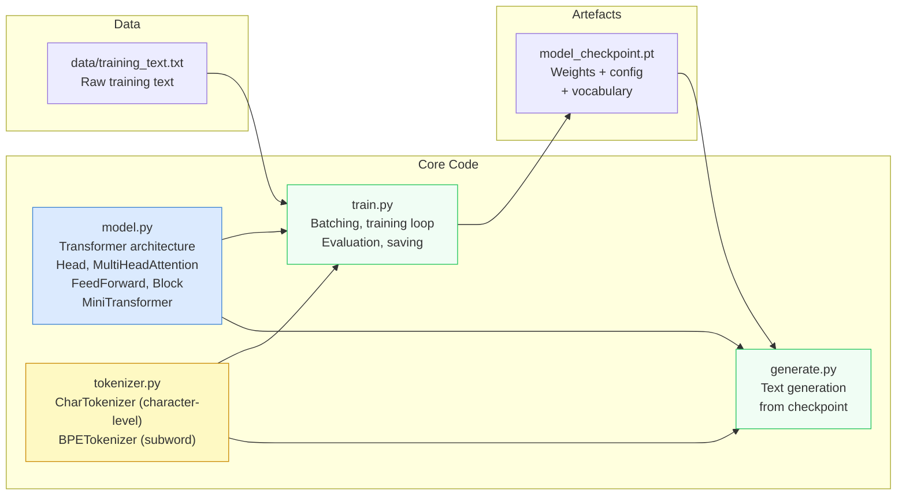

### Sources and Further Reading

- **Original paper:** [Attention Is All You Need](https://arxiv.org/abs/1706.03762) (Vaswani et al., 2017)
- **GPT-style Decoder-Only:** [Language Models are Unsupervised Multitask Learners](https://cdn.openai.com/better-language-models/language_models_are_unsupervised_multitask_learners.pdf) (GPT-2, 2019)
- **Original BPE paper:** [Neural Machine Translation of Rare Words with Subword Units](https://arxiv.org/abs/1508.07909) (Sennrich et al., 2016)
- **Excellent video introduction:** Andrej Karpathy's "Let's build GPT from scratch" (YouTube) – this code follows a similar approach
