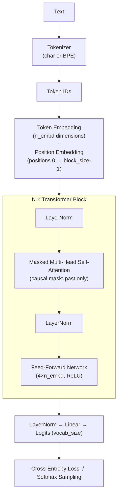

# User Guide: Mini-LLM Transformer

This guide describes how to set up the project **locally**, start training, interpret the output, and experiment with hyperparameters.

> **Google Colab:** If you want to run the project directly in the browser without a local installation, see the step-by-step guide in [COLAB.md](COLAB.md).

---

## Table of Contents

1. [Prerequisites](#1-prerequisites)
2. [Installation](#2-installation)
3. [Starting Training](#3-starting-training)
4. [Understanding the Output](#4-understanding-the-output)
5. [Tokenizer: char vs. BPE](#5-tokenizer-char-vs-bpe)
6. [Adjusting Hyperparameters](#6-adjusting-hyperparameters)
7. [Observable Learning Phases](#7-observable-learning-phases)
8. [Extending Training Data](#8-extending-training-data)
9. [Loading a Model Checkpoint](#9-loading-a-model-checkpoint)
10. [Architecture Overview](#10-architecture-overview)
11. [Tips for Experiments](#11-tips-for-experiments)

---

## 1. Prerequisites

| Requirement | Version |
|---|---|
| [uv](https://docs.astral.sh/uv/) | current |
| Python | 3.10 – 3.12 (installed automatically by uv) |
| Operating system | macOS Intel (x86_64), optimised for CPU |

> **Note:** Python 3.13 is not yet supported by PyTorch on Intel Mac. uv automatically installs the matching version 3.12.

---

## 2. Installation

```bash
# Navigate to the project folder
cd /Users/andreaseidmann/Development/llm-mini-transformer

# Install Python 3.12 (once) and resolve dependencies
uv sync --python 3.12
```

uv automatically creates an isolated virtual environment under `.venv/` and installs:
- `torch 2.2.x` – neural network framework
- `tqdm` – progress bar

---

## 3. Starting Training

`train.py` provides two built-in **modes** as quick configurations. All other parameters can additionally be passed as flags and override the mode defaults.

### Modes

| Mode | Command | File | Tokenizer | Model | Iterations |
|---|---|---|---|---|---|
| **simple** *(default)* | `uv run python train.py` | `training_text_simple.txt` | char | small (32/4/2) | 1,000 |
| **advanced** | `uv run python train.py --mode advanced` | `training_text.txt` | BPE | medium (96/6/4) | 6,000 |

```bash
# simple mode — short text, character tokenizer, small model (default)
uv run python train.py

# advanced mode — large text, BPE, standard architecture
uv run python train.py --mode advanced

# Override individual parameters (mode serves as baseline)
uv run python train.py --max_iters 500
uv run python train.py --mode advanced --batch_size 64
uv run python train.py --mode simple --tokenizer bpe --bpe_vocab_size 300
```

The script runs entirely on the CPU. Typical runtimes on an Intel Mac:

| Mode | `max_iters` | Approximate duration |
|---|---|---|
| simple | 1,000 | ~1–2 minutes |
| advanced | 3,000 | ~5 minutes |
| advanced | 6,000 | ~10 minutes |

After completion the model is automatically saved as `model_checkpoint.pt`.

### All available flags

```
--mode {simple,advanced}   Preset mode (default: simple)

-- Data & Tokenizer --
--data_path PATH           Path to training text
--tokenizer {char,bpe}     Tokenizer type
--bpe_vocab_size N         BPE vocabulary size

-- Model --
--block_size N             Context length in tokens
--n_embd N                 Embedding dimension
--n_heads N                Number of attention heads
--n_layers N               Number of transformer blocks
--dropout F                Dropout rate

-- Training --
--batch_size N             Batch size
--max_iters N              Maximum iterations
--learning_rate F          Learning rate
--use_lr_scheduler BOOL    Learning-rate scheduler (true/false)
--eval_interval N          Evaluation interval
--train_split F            Training fraction (0–1)
--seed N                   Random seed

-- Generation --
--gen_start_text TEXT      Seed text for intermediate generation
--gen_max_tokens N         Tokens per intermediate generation
--gen_temperature F        Sampling temperature
--gen_top_k N              Top-K (0 = disabled)
```

---

## 4. Understanding the Output

At startup the script prints a summary of the configuration:

```
═════════════════════════════════════════════════════════════════
  Mini-Transformer – Learning Experiment
═════════════════════════════════════════════════════════════════
  Device         : cpu
  Total chars    : 5,306
  Vocabulary size: 68 unique characters
  ...
```

Every `eval_interval` iterations an intermediate report appears:

```
─────────────────────────────────────────────────────────────────
  Iter   250/5000  ( 5.0%)  Time: 28s
  Train-Loss: 2.8134  |  Val-Loss: 2.9021  |  LR: 9.50e-04

  ▶ Generated text:
  'Der Wald ist ein wich...'
```

| Output | Meaning |
|---|---|
| `Train-Loss` | Error on training data – should decrease |
| `Val-Loss` | Error on held-out data – indicates generalisation |
| `LR` | Current learning rate (drops when scheduler is active) |
| Generated text | Live sample of how well the model already writes |

> **Tip:** If `Val-Loss` becomes significantly larger than `Train-Loss`, the model is overfitting to the training data. Increase `dropout` in that case.

---

## 5. Tokenizer: char vs. BPE

The project supports two tokenisation strategies. The selection is made in `train.py` via the `CONFIG` key `"tokenizer"`.

### Variant 1 – Character-level (`"char"`)

Every individual character in the text gets its own token ID. The vocabulary corresponds exactly to the set of all unique characters in the training text (typically 60–100 tokens).

```python
"tokenizer":    "char",   # each character = one token
# bpe_vocab_size is ignored for "char"
```

| Property | Value |
|---|---|
| Vocabulary size | Number of unique characters (~60–100) |
| Sequence length | 1 token per character – very long sequences |
| Training | Instant, no learning step required |
| Context window | Covers only a few words (depending on `block_size`) |
| Suitable for | Quick experiments, very short texts |

### Variant 2 – Byte Pair Encoding (`"bpe"`) ← Default

Frequently co-occurring characters are iteratively merged into subword tokens. Common words receive their own token; rare words are split into known sub-pieces.

```python
"tokenizer":     "bpe",   # subword tokeniser (recommended)
"bpe_vocab_size": 2000,   # target vocabulary size (500–4000)
```

| Property | Value |
|---|---|
| Vocabulary size | Configurable via `bpe_vocab_size` (default: 2000) |
| Sequence length | 1 token ≈ 2–4 characters → **shorter** sequences |
| Training | One-time BPE learning step before model training |
| Context window | Same `block_size`, but effectively covers more text |
| Suitable for | All cases with sufficient training text (≥ 5,000 characters) |

### `bpe_vocab_size` – Guidelines

| Value | Text size | Effect |
|---|---|---|
| `500` | short texts (< 5,000 chars) | small vocabulary, fast training |
| `2000` | **default** (recommended) | good balance of compression and coverage |
| `4000` | large texts (> 50,000 chars) | finer subwords, slightly slower |

> **Rule of thumb:** About one additional merge step makes sense per ~200 characters of training text.
> For 10,000 characters of text, `bpe_vocab_size=500` is already sufficient; `2000` works fine as well.

### Switching via CLI

```bash
# Character-level (equivalent to simple mode):
uv run python train.py --tokenizer char

# BPE (equivalent to advanced mode):
uv run python train.py --tokenizer bpe --bpe_vocab_size 2000
```

> **Important:** If you change the tokeniser type, the model **must be retrained**.
> A checkpoint saved with BPE cannot be loaded with the char tokeniser – delete or rename the checkpoint file.

---

## 6. Adjusting Hyperparameters

All parameters can be passed as CLI flags and override the mode preset:

```bash
uv run python train.py --block_size 128 --n_embd 64 --n_heads 4
```

### Context length: `block_size`

How many characters the model sees as context at once.

| Value | Effect |
|---|---|
| `32` | Very fast, short context – learns only short patterns |
| `64` | **Default** – good balance |
| `128` | Longer context, but ~2× slower |

### Batch size: `batch_size`

How many text snippets are processed per training step.

| Value | Effect |
|---|---|
| `16` | Low RAM, noisier gradient updates |
| `32` | **Default** |
| `64` | More stable updates, more memory required |

### Model size: `n_embd`, `n_heads`, `n_layers`

```python
"n_embd":   64,   # embedding dimension (model width)
"n_heads":  4,    # attention heads — n_embd must be divisible by n_heads!
"n_layers": 4,    # number of stacked transformer blocks (depth)
```

> **Important:** `n_embd` must always be evenly divisible by `n_heads`.  
> Example: `n_embd=128` → `n_heads=8` ✓ | `n_heads=6` ✗

### Learning rate & scheduler

```python
"learning_rate":    1e-3,   # start value; lower to 5e-4 or 1e-4 on plateau
"use_lr_scheduler": True,   # True → linear decay to 10% of the start value
```

### Intermediate generation

```bash
uv run python train.py \
  --eval_interval 250 \
  --gen_start_text "Der" \
  --gen_max_tokens 120 \
  --gen_temperature 0.8 \
  --gen_top_k 40
```

---

## 7. Observable Learning Phases

| Loss range | What you see in the generated text |
|---|---|
| ~4.2 | Pure character soup, no patterns at all |
| ~3.5 | Frequent characters (`e`, `n`, space) accumulate |
| ~2.5 | Word-like structures, occasional real words |
| ~2.0 | Short words, simple word sequences |
| ~1.5 | Real words dominate, rudimentary grammar visible |

---

## 8. Extending Training Data

More text in `data/training_text.txt` → less overfitting → smoother generated text.
Recommendation: at least 5,000 characters, ideally 20,000+. The vocabulary (all unique characters) is derived automatically from the new text.

### Option A: Automatically fetch Wikipedia articles

The script `fetch_wikipedia.py` downloads Wikipedia articles via API, cleans the text (special characters, wiki markup), and appends it directly to `data/training_text.txt`.

```bash
# Fetch and append articles (default)
uv run python fetch_wikipedia.py

# Preview only, write nothing (dry run)
uv run python fetch_wikipedia.py --dry-run

# More text per article (default: 4000 characters)
uv run python fetch_wikipedia.py --max-chars 8000

# Different target file
uv run python fetch_wikipedia.py --output data/my_text.txt
```

| Option | Default | Description |
|---|---|---|
| `--output` | `data/training_text.txt` | Target file |
| `--max-chars` | `4000` | Maximum characters per article |
| `--dry-run` | off | Preview only, do not write |

**Customising the article list:** The variable `ARTIKEL` at the top of `fetch_wikipedia.py` contains the articles to be fetched. Simply add or remove entries – German Wikipedia titles, spaces as `_`.

```python
ARTIKEL = [
    "Elbe",
    "Schwarzwald",
    "Sonnensystem",
    # add any number of additional articles ...
]
```

> **Note:** Umlauts in titles may need to be URL-encoded (e.g. `ä` → `%C3%A4`). Most titles work directly, however.

### Option B: Insert your own text

```bash
# Append text from clipboard (macOS)
pbpaste >> data/training_text.txt

# Or open directly in an editor and paste text
```

---

## 9. Using the Model After Training

After training, `model_checkpoint.pt` is saved. For text generation there is the ready-made script `generate.py`.

### Simple start

```bash
uv run python generate.py
```

Uses the saved checkpoint and starts with the seed word `"Der"`.

### Options

```bash
uv run python generate.py --start "Die Wissenschaft"   # different seed word
uv run python generate.py --tokens 500                 # generate more characters
uv run python generate.py --temperature 0.5            # more focused (less randomness)
uv run python generate.py --temperature 1.2            # more creative (more randomness)
uv run python generate.py --top_k 10                   # only top-10 candidates
```

### All options at a glance

| Option | Default | Description |
|---|---|---|
| `--checkpoint` | `model_checkpoint.pt` | Path to the saved checkpoint |
| `--start` | `"Der"` | Seed text for generation |
| `--tokens` | `200` | Number of characters to generate |
| `--temperature` | `0.8` | `< 1.0` focused · `> 1.0` creative |
| `--top_k` | `40` | Only the k most probable candidates |

### Combining multiple options

```bash
uv run python generate.py \
  --start "Der Wald ist" \
  --tokens 400 \
  --temperature 0.6 \
  --top_k 20
```

---

## 10. Architecture Overview



**Decoder-Only / Causal:** Position `i` may only attend to positions `0…i` – never the future. This is the fundamental property of GPT-style models.

| File | Contents |
|---|---|
| `model.py` | `Head`, `MultiHeadAttention`, `FeedForward`, `Block`, `MiniTransformer` |
| `tokenizer.py` | `CharTokenizer`, `BPETokenizer`, `build_tokenizer` – both tokeniser variants |
| `train.py` | Data loader, training loop, evaluation, generation |

---

## 11. Tips for Experiments

1. **Start with `simple`:** The simple mode is intentionally fast — ideal for a first try. Then switch to a larger dataset with `--mode advanced`.
2. **Start small:** `uv run python train.py --n_embd 32 --n_layers 2` – observe the output, then scale up gradually.
3. **Detect overfitting:** `val_loss` rises while `train_loss` falls → add `--dropout 0.2`.
4. **Overcome a plateau:** Loss stagnates → try `--learning_rate 5e-4` or `--use_lr_scheduler true`.
5. **Explore temperature:** `uv run python generate.py --temperature 0.2` (very focused) to `--temperature 1.5` (very creative) and compare the texts.
6. **More data:** The more text in `data/training_text.txt`, the smoother the generated text. Use `fetch_wikipedia.py` and then train with `--mode advanced`.
