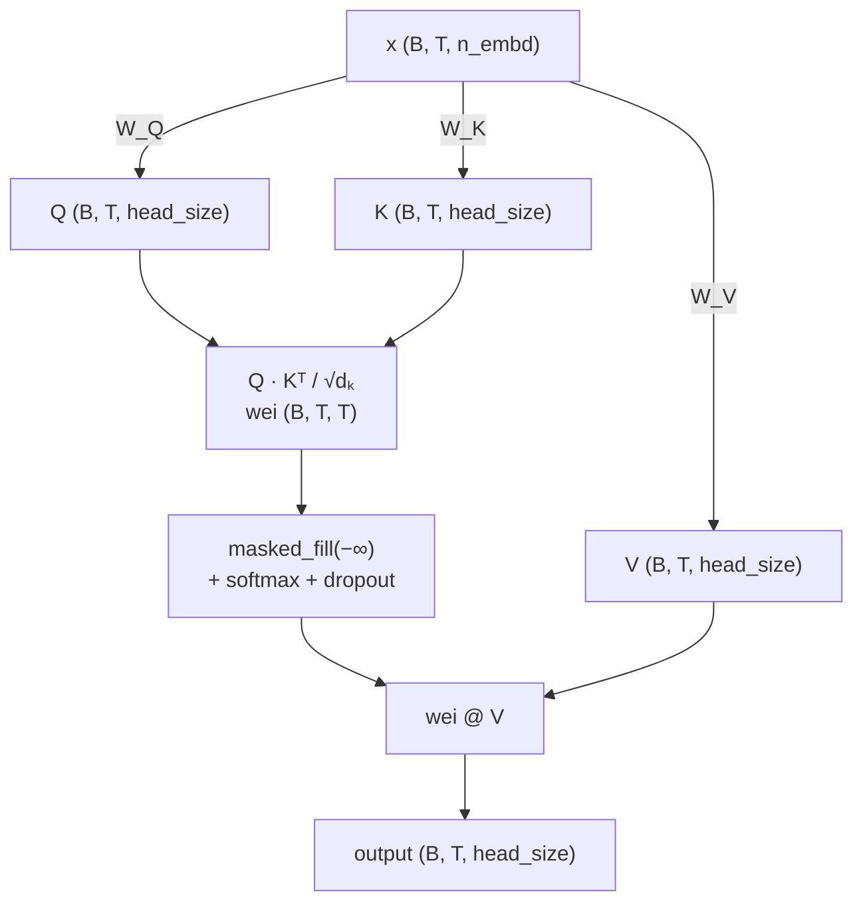
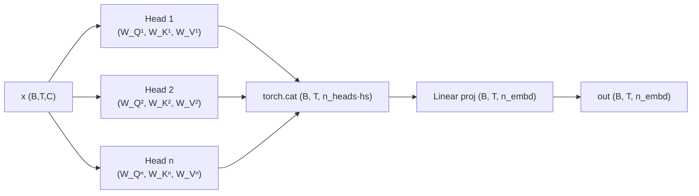

# `class Head(nn.Module)` — Scaled Dot-Product Attention

> **Datei:** `model.py`, Zeile 27 · Ein kausaler Single-Head Attention-Mechanismus

## Was macht ein Attention-Head?

Ein Attention-Head entscheidet für jede Token-Position im Eingabe-Tensor, **welche anderen Positionen wie stark relevant sind**, und erzeugt daraus einen neuen, kontextangereicherten Vektor.  
Im Decoder-Only-Modell (GPT-Stil) darf dabei jede Position *nur in die Vergangenheit* schauen — das erzwingt die kausale Maske.

---

## 1. Initialisierung — `__init__`

Vier Objekte werden registriert:

```python
self.key   = nn.Linear(n_embd, head_size, bias=False)  # W_K
self.query = nn.Linear(n_embd, head_size, bias=False)  # W_Q
self.value = nn.Linear(n_embd, head_size, bias=False)  # W_V

self.register_buffer("tril", torch.tril(torch.ones(block_size, block_size)))
self.dropout = nn.Dropout(dropout)
```

| Symbol | Frage | Beschreibung |
|--------|-------|-------------|
| **K** `key` | *"Was biete ich an?"* | Projiziert jeden Eingabe-Vektor auf einen `head_size`-dim. Key-Vektor. Lernbare Matrix $W_K \in \mathbb{R}^{n\_embd \times head\_size}$ |
| **Q** `query` | *"Was suche ich?"* | Projiziert auf einen Query-Vektor. Lernbare Matrix $W_Q \in \mathbb{R}^{n\_embd \times head\_size}$ |
| **V** `value` | *"Was gebe ich weiter?"* | Enthält die eigentliche Information. Lernbare Matrix $W_V \in \mathbb{R}^{n\_embd \times head\_size}$ |
| **▽** `tril` | *(nicht lernbar)* | Untere Dreiecksmatrix als fester Buffer — blockiert den Blick in die Zukunft. `register_buffer` sorgt dafür, dass sie bei `.to(device)` mitgenommen wird. |

---

## 2. Forward-Pass — Schritt für Schritt

```python
B, T, C = x.shape   # Batch-Größe | Sequenzlänge (Zeitschritte) | Kanäle (n_embd)
```

Der Eingabe-Tensor `x` hat die Form `(B, T, C)` —  
B parallele Sequenzen, jede mit T Tokens, jedes Token als C-dimensionaler Vektor.

### Schritt 1 — Projektion auf Q, K, V

```python
k = self.key(x)    # (B, T, head_size)
q = self.query(x)  # (B, T, head_size)
v = self.value(x)  # (B, T, head_size)
```

Jedes der T Tokens bekommt einen eigenen Key-, Query- und Value-Vektor durch die gelernten Projektionen.

### Schritt 2 — Attention-Scores (Scaled Dot-Product)

$$\text{wei} = Q \cdot K^\top \cdot (head\_size)^{-\frac{1}{2}}$$

Form: `(B, T, T)` — für jedes Token-Paar (i, j) ein Score.

```python
wei = q @ k.transpose(-2, -1) * (head_size ** -0.5)   # (B, T, T)
```

Das Skalarprodukt von Query *i* mit Key *j* misst, wie relevant Token j für Token i ist.  
Die Skalierung mit $\frac{1}{\sqrt{head\_size}}$ verhindert, dass die Werte bei großem `head_size` so groß werden, dass Softmax gesättigte Gradienten produziert.

### Schritt 3 — Kausale Maske (Decoder-Eigenschaft)

```python
wei = wei.masked_fill(self.tril[:T, :T] == 0, float("-inf"))
```

Alle Positionen *oberhalb* der Hauptdiagonale (Zukunft) werden auf $-\infty$ gesetzt.  
Nach Softmax werden diese zu exakt 0 — das Modell "sieht" sie nicht.

**`tril`-Matrix (T=4) — `1` = erlaubt, `0` = geblockt:**

```
tril             →   nach Softmax
┌─────────────┐      ┌──────────────────┐
│ 1  0  0  0  │      │ 1.0   0    0    0  │
│ 1  1  0  0  │      │  .6   .4   0    0  │
│ 1  1  1  0  │      │  .5   .3   .2   0  │
│ 1  1  1  1  │      │  .4   .3   .2   .1 │
└─────────────┘      └──────────────────┘
```

> **Intuition:** Token 0 sieht nur sich selbst. Token 3 sieht alle 4 Tokens.  
> Kein Token kann in die Zukunft schauen — das ist die autoregressive Eigenschaft des Decoders.

### Schritt 4 — Softmax & Dropout

```python
wei = F.softmax(wei, dim=-1)  # Gewichte summieren sich pro Zeile auf 1
wei = self.dropout(wei)        # Regularisierung: zufällig Connections kappen
```

Softmax normiert die Scores zeilenweise zu Wahrscheinlichkeiten.  
Dropout setzt zufällig einige Attention-Gewichte auf 0 (nur beim Training), was Überanpassung reduziert.

### Schritt 5 — Gewichtete Summe über Values

$$\text{output} = \text{wei} \cdot V \quad \text{Form: } (B, T, head\_size)$$

```python
return wei @ v
```

Jedes Output-Token ist eine gewichtete Summe aller (erlaubten) Value-Vektoren.  
Hohe Attention-Gewichte bedeuten: *"Dieser Value-Vektor trägt stark zu meiner Ausgabe bei."*

---

## Die vollständige Formel

$$\text{Attention}(Q, K, V) = \text{softmax}\!\left(\frac{Q \cdot K^\top}{\sqrt{d_k}}\right) \cdot V$$

> $d_k = head\_size$ · Masking der oberen Dreiecke **vor** Softmax

---

## Datenfluss auf einen Blick



---

## Einbettung in `MultiHeadAttention`

Die Klasse `MultiHeadAttention` erstellt `n_heads` parallele Instanzen von `Head`, jede mit eigenem $W_Q$, $W_K$, $W_V$. Jeder Head lernt andere Aspekte der Beziehungen zwischen Tokens (z.B. Syntax, Semantik, Position). Die Ausgaben aller Heads werden konkateniert und durch eine lineare Projektion auf `n_embd` zurückgeführt.

```python
# In MultiHeadAttention.forward:
out = torch.cat([h(x) for h in self.heads], dim=-1)  # (B, T, n_heads * head_size)
return self.dropout(self.proj(out))                    # (B, T, n_embd)
```


