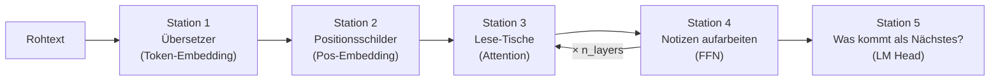
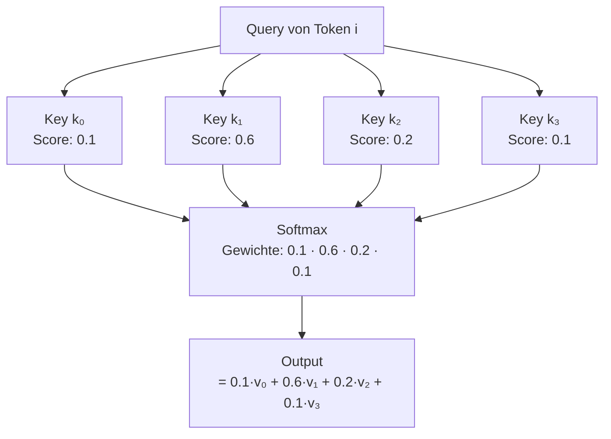
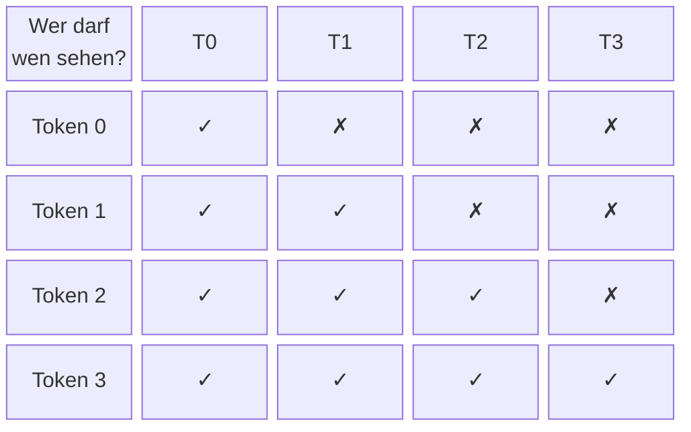
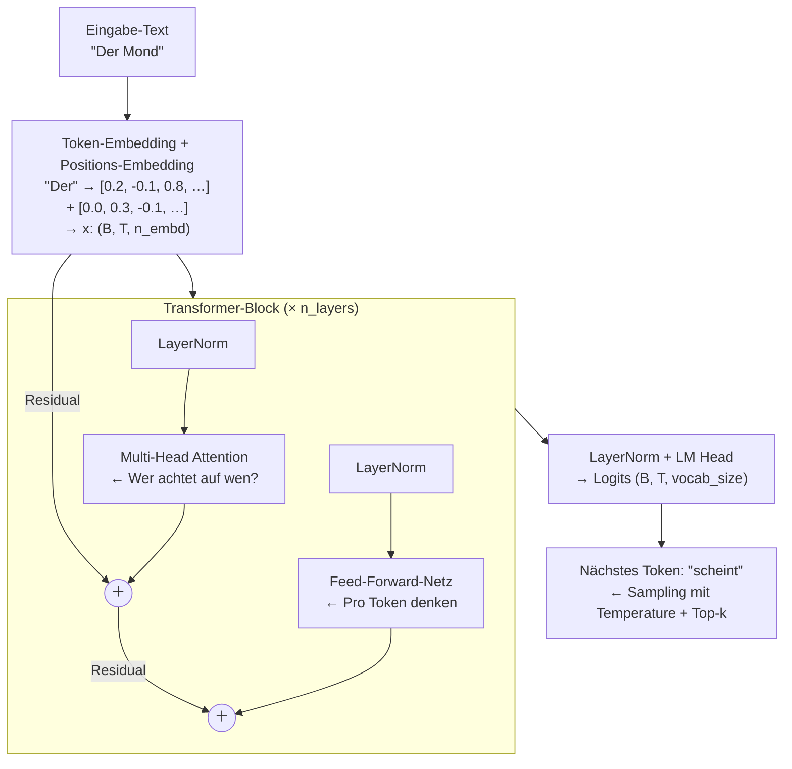
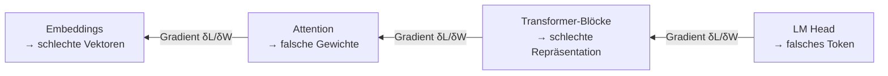
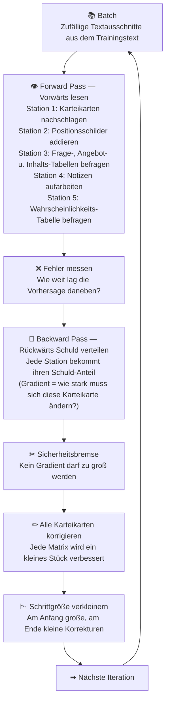
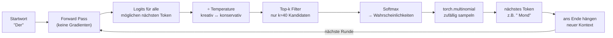
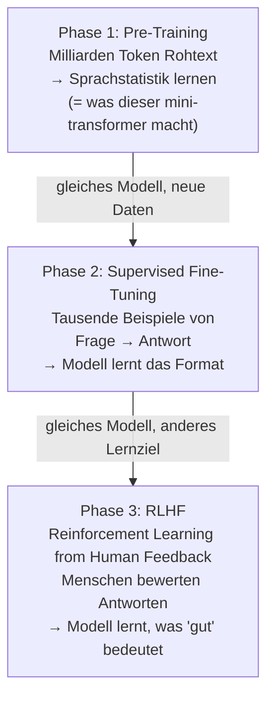
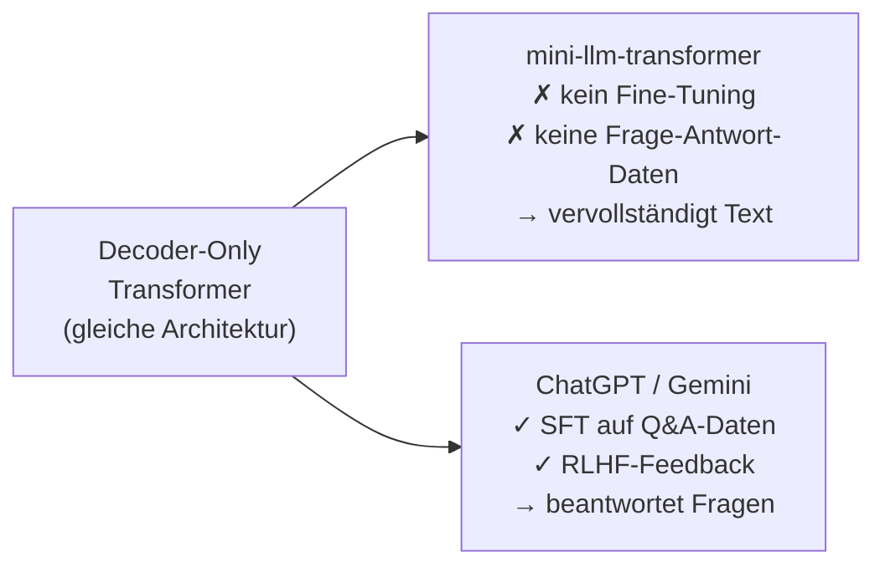

# Wie funktioniert der llm-mini-transformer?

> **Ziel dieses Dokuments:** Das gesamte Modell in einem durchgängigen Bild erklären — von rohem Text bis zum generierten Satz — mit einer Analogie, die sich leicht einprägen lässt, und einem Glossar mit Lernhilfen für jedes Fachwort.

---

## Die durchgängige Analogie: die Bibliothek mit Lese-AGs

Stell dir vor, du bist **Bibliothekar** und möchtest automatisch den nächsten Satz eines Buches weiterschreiben. Dazu rufst du eine **Lese-AG** (das Modell).

Die AG arbeitet in fünf Stationen — **genau die fünf Stufen des Transformers**:



Diese fünf Stationen werden als **Schleife** mehrfach durchlaufen (= `n_layers` Transformer-Blöcke), bevor am Ende eine Antwort entsteht.

---

## Station 1 — Der Übersetzer (Token-Embedding)

**Was passiert?**  
Jedes Zeichen (oder Wort-Stück) wird in eine **Zahlen-Wolke** (Vektor) verwandelt.

**Bibliotheks-Analogie:**  
Jedes Wort bekommt eine **Karteikarte** mit 64–128 Zahlen drauf — wie ein Steckbrief, der beschreibt, welche Bedeutung das Wort hat, wie es sich anfühlt, ob es eher Nomen oder Verb ist usw. Anfangs sind die Zahlen zufällig; das Modell lernt im Training die sinnvollen Steckbriefe.

**Im Code:**
```python
tok_emb = self.token_embedding(idx)   # (B, T, n_embd)
```

> 📍 **Debugger-Haltepunkt:** [`model.py:184`](../../model.py:184) — hier siehst du `tok_emb` mit Form `(batch_size, T, n_embd)`.

| Fachwort | Lernhilfe |
|---|---|
| **Token** | Ein Stück Text — hier: einzelnes Zeichen oder Silbe. Denk an Legostein. |
| **Embedding** | Die Karteikarte eines Tokens: ein Vektor mit z.B. 96 Zahlen. |
| **Vokabular (`vocab_size`)** | Die Gesamtzahl aller möglichen Legostein-Typen. |
| **`n_embd`** | Wie viele Zahlen pro Karteikarte. Größer = mehr Ausdrucksvermögen. |

---

## Station 2 — Die Positionsschilder (Positions-Embedding)

**Was passiert?**  
Zu jeder Karteikarte wird noch eine zweite Karteikarte **addiert**, die nur die **Position** (Stelle 0, 1, 2, …) beschreibt.

**Bibliotheks-Analogie:**  
Alle Bücher in der Bibliothek haben denselben Grundsteckbrief für das Wort „Katze" — aber ein Buch, das auf **Seite 3** ein Wort hat, weiß durch das Positionsschild, dass es auf Seite 3 steht. Ohne dieses Schild würde das Modell keinen Unterschied machen, ob „Katze" am Anfang oder am Ende des Satzes steht.

```python
pos_emb = self.position_embedding(torch.arange(T, device=idx.device))  # (T, n_embd)
x = tok_emb + pos_emb   # addiert: gleiche Form bleibt (B, T, n_embd)
```

> 📍 **Debugger-Haltepunkt:** [`model.py:185-186`](../../model.py:185) — nach Zeile 186 enthält `x` die Summe aus Token- und Positions-Embedding.

| Fachwort | Lernhilfe |
|---|---|
| **Positions-Embedding** | Das Positionsschild. Sagt: „Ich bin das 5. Token in diesem Satz." |
| **`block_size`** | Maximale Satzlänge, die das Modell kennt. Wie viele Seiten ein Buch maximal hat. |

---

## Station 3 — Die Lese-Tische (Multi-Head Self-Attention)

Das ist **der Kern** des Transformers. Hier passiert die eigentliche Intelligenz.

### Die Idee in einem Satz

Jedes Token fragt alle **früheren** Tokens: *„Bist du gerade für mich relevant?"* — und mischt dann deren Inhalt proportional zur Relevanz zusammen.

### Bibliotheks-Analogie: Frage–Angebot–Inhalt

Jede Karteikarte bekommt **drei Rollen**:

| Rolle | Frage | Bibliotheks-Bild |
|---|---|---|
| **Query (Q)** | *Was suche ich gerade?* | Das Recherche-Zettelchen, das du in die Kartothek steckst. |
| **Key (K)** | *Was biete ich an?* | Das Beschriftungsschild eines Regals. |
| **Value (V)** | *Was steht wirklich drin?* | Der eigentliche Buch-Inhalt im Regal. |

**Ablauf:**
1. Dein Query-Zettel wird mit allen Key-Schildern verglichen → **Ähnlichkeits-Score**
2. Ähnlichste Regale bekommen hohe Gewichte (Softmax → Summe = 1)
3. Dein Output = gewichteter Durchschnitt aller Buch-Inhalte (Values)



### Die Kausale Maske — kein Blick in die Zukunft

Token 2 darf **nicht** sehen, was Token 3 sagt (das würde schummeln beim Schreiben). Zukünftige Positionen werden auf $-\infty$ gesetzt, nach Softmax also 0:



### Warum mehrere Heads?

**Multi-Head Attention** betreibt mehrere Lese-Tische *gleichzeitig* — jeder sucht nach etwas anderem:

- Head 1: grammatikalische Abhängigkeiten
- Head 2: semantische Ähnlichkeit
- Head 3: Abstand im Satz
- …

Alle Ergebnisse werden zusammengefügt und auf die ursprüngliche Größe projiziert.

**Im Code:**
```python
# In MultiHeadAttention.forward:
out = torch.cat([h(x) for h in self.heads], dim=-1)  # Alle Heads zusammenklappen
return self.dropout(self.proj(out))                    # Auf n_embd projizieren
```

> 📍 **Debugger-Haltepunkte:**
> - [`model.py:46-57`](../../model.py:46) (`Head.forward`) — `k`, `q`, `wei` nach Scaled-Dot-Product, Maske und Softmax inspizieren
> - [`model.py:78`](../../model.py:78) (`MultiHeadAttention.forward`) — `out` enthält alle Heads zusammengeklappt

| Fachwort | Lernhilfe |
|---|---|
| **Self-Attention** | „Self" = das Modell achtet auf sich selbst (seinen eigenen Satz), kein externes Wörterbuch. |
| **Scaled Dot-Product** | Skalarprodukt ÷ √head_size. Das Teilen verhindert, dass Zahlen zu groß werden und Softmax einfriert. |
| **Softmax** | Verwandelt beliebige Zahlen in Wahrscheinlichkeiten (alle ≥ 0, Summe = 1). Wie Abstimmen: hohe Zahlen gewinnen. |
| **Kausale Maske** | Der Sichtschutz: zukünftige Tokens werden versteckt. Autoregressive Eigenschaft. |
| **`n_heads`** | Anzahl der Lese-Tische. z.B. 6 parallele Heads. |
| **`head_size`** | Breite eines einzelnen Heads = `n_embd / n_heads`. |

---

## Station 4 — Notizen aufarbeiten (Feed-Forward-Netz)

**Was passiert?**  
Nach der Attention bekommt jedes Token **für sich allein** nochmal einen Denk-Schritt: ein kleines neuronales Netz, das die gemischten Informationen verarbeitet und komplexere Muster extrahiert.

**Bibliotheks-Analogie:**  
Nachdem du alle relevanten Bücher durchgesehen hast, setzt du dich hin und schreibst **eigene Notizen** daraus — du destillierst die Information. Das geschieht für jedes Wort einzeln, ohne nochmal andere Worte anzusehen.

```python
# FeedForward: 2-schichtiges MLP, inner 4× größer als n_embd
self.net = nn.Sequential(
    nn.Linear(n_embd, 4 * n_embd),  # Aufweiten
    nn.ReLU(),                        # Nicht-Linearität
    nn.Linear(4 * n_embd, n_embd),  # Zusammenziehen
    nn.Dropout(dropout),
)
```

> 📍 **Debugger-Haltepunkt:** [`model.py:100-101`](../../model.py:100) (`FeedForward.forward`) — `x` vor und nach `self.net(x)` vergleichen: gleiche Form, andere Werte.

| Fachwort | Lernhilfe |
|---|---|
| **MLP / Feed-Forward** | Multi-Layer Perceptron. Klassisches neuronales Netz: Eingabe → Versteckt → Ausgabe. |
| **ReLU** | „Rectified Linear Unit" = `max(0, x)`. Negative Zahlen → 0, positive bleiben. Wie ein Filter: nur gute Signale durch. |
| **`4 × n_embd`** | Die innere Schicht ist bewusst 4× breiter — mehr Platz zum „Denken". |

---

## Station 3+4 zusammen: der Transformer-Block

Stationen 3 und 4 zusammen bilden **einen Transformer-Block**. Das Modell stapelt `n_layers` solcher Blöcke übereinander. Jeder Block verfeinert das Verständnis ein bisschen mehr.

Zwei wichtige Tricks machen das Stapeln stabil:

### Residual-Verbindung — „Vergiss nicht, was du weißt"

```python
x = x + self.sa(self.ln1(x))   # Attention-Ergebnis wird zum Eingang addiert
x = x + self.ff(self.ln2(x))   # FFN-Ergebnis wird zum Eingang addiert
```

> 📍 **Debugger-Haltepunkt:** [`model.py:122-125`](../../model.py:122) (`Block.forward`) — nach jeder Zeile siehst du, wie `x` durch die Residual-Verbindung erhalten bleibt und nur leicht verändert wird.

**Analogie:** Du hast einen langen Brief geschrieben. Statt ihn komplett zu ersetzen, fügst du nur *Korrekturen am Rand* ein. Das Original bleibt erhalten; die Schicht ändert nur das, was nötig ist.

### Layer Normalization — „Gleiche Maßstäbe"

Vor jedem Block wird der Vektor normiert (Mittelwert → 0, Varianz → 1). Verhindert, dass einzelne Werte explodieren.

**Analogie:** Alle Schüler einer Klasse bekommen Noten auf der gleichen Skala (1–6), egal wie schwer der Test war.

| Fachwort | Lernhilfe |
|---|---|
| **Residual-Verbindung** | Abkürzungs-Kabel: Ergebnis = Eingang + kleiner Korrektur. Gradient fließt ungehindert zurück. |
| **LayerNorm** | Normierung pro Token-Vektor. Pre-Norm (vor der Schicht) ist stabiler als Post-Norm. |
| **`n_layers`** | Anzahl gestapelter Blöcke. Tiefer = mehr Abstraktionsebenen, aber langsamer. |

---

## Station 5 — Was kommt als Nächstes? (Language Model Head)

**Was passiert?**  
Der letzte Vektor jedes Tokens wird auf die Größe des Vokabulars projiziert. Daraus entstehen **Logits** — eine Zahl pro möglichem nächstem Token. Die größte Zahl gewinnt (mit etwas Zufall).

```python
x = self.ln_final(x)       # Letzte Normierung
logits = self.lm_head(x)   # (B, T, vocab_size) — ein Score pro möglichem Zeichen
```

> 📍 **Debugger-Haltepunkt:** [`model.py:189-195`](../../model.py:189) (`MiniTransformer.forward`) — `logits` hat Form `(B, T, vocab_size)`; `loss` ist ein Skalar. Beim Inspizieren von `logits[0, -1]` siehst du die Rohscores für das nächste Token.

**Bibliotheks-Analogie:**  
Am Ende schreibt der Bibliothekar für jedes Wort im Vokabular auf einen Zettel: *„Wie wahrscheinlich ist es, dass dieses Wort als Nächstes kommt?"* Das wahrscheinlichste Wort (oder ein zufällig gewähltes aus den Top-k) wird ausgegeben.

| Fachwort | Lernhilfe |
|---|---|
| **Logits** | Rohe, unnormierte Scores. Noch keine Wahrscheinlichkeiten — erst nach Softmax. |
| **Cross-Entropy-Loss** | Strafe beim Training: Wie weit liegt der vorhergesagte Token vom richtigen entfernt? |
| **Decoder-Only** | Das Modell schreibt nur vorwärts — kein separater Encoder für die Eingabe (wie bei GPT). |

---

## Das Gesamtbild auf einen Blick



---

## Training vs. Generierung

### Training — Die Bibliothek lernt durch Fehler

**Bibliotheks-Analogie:**
Stell dir vor, die Lese-AG bekommt tausende Buchseiten zum Üben. Sie deckt das letzte Wort jedes Satzes ab und rät: *„Was kommt als Nächstes?"* Ein strenger Korrekteur vergleicht die Antwort mit dem echten Wort und notiert den **Fehler (Loss)**. Die AG verbessert sich — aber nicht einfach durch „nochmal lesen". Der Korrekteur erklärt ihr rückwärts, welche Entscheidungen auf welchem Lese-Tisch den Fehler verursacht haben. Genau das ist **Backpropagation**.

#### Schritt 1 — Forward Pass: Vorhersage treffen

Das Modell liest den Kontext und erzeugt für jede Position einen Wahrscheinlichkeits-Vektor über alle Tokens:

```python
x, y = get_batch(train_data, block_size, batch_size)
logits, loss = model(x, y)   # forward pass + loss in einem Schritt
```

> 📍 **Debugger-Haltepunkt:** [`train.py:392-393`](../../train.py:392) — hier beginnt ein einzelner Trainingsschritt. `x` ist der Eingabe-Batch `(B, T)`, `y` die erwarteten Ziel-Tokens, `loss` der skalare Fehlerwert.

Konkret: Eingabe `"Der Mo"` → Modell sagt `"n"` mit nur 5 % Wahrscheinlichkeit → **hoher Loss**.

#### Schritt 2 — Loss berechnen: Cross-Entropy

Die **Cross-Entropy** misst, wie weit die vorhergesagte Wahrscheinlichkeitsverteilung vom richtigen Token entfernt ist. Je überraschter das Modell vom richtigen Token ist, desto höher der Verlust:

```
Richtiges Token: "n"
Modell-Verteilung: {"m": 40%, "g": 30%, "n": 5%, ...}
→ Loss = -log(0.05) ≈ 3.0   (sehr hoch)

Nach Training:
Modell-Verteilung: {"n": 85%, "m": 8%, ...}
→ Loss = -log(0.85) ≈ 0.16  (niedrig)
```

#### Schritt 3 — Backward Pass: Fehler zurückschicken

`loss.backward()` berechnet für jedes einzelne Gewicht im Netz den **Gradienten** — die Antwort auf: *„Wenn ich dieses Gewicht ein kleines Stück erhöhe, wird der Fehler größer oder kleiner?"*

**Bibliotheks-Analogie:**
Der Korrekteur geht rückwärts durch alle Stationen: Er sagt dem LM-Head *„Du hast falsch geraten"*, der LM-Head sagt den Transformer-Blöcken *„eure Ausgabe war schuld"*, die Transformer-Blöcke sagen der Attention *„du hast auf die falschen Tokens geachtet"* — bis hin zu den Embeddings. Jede Station bekommt einen Schuld-Anteil (Gradient).



#### Schritt 4 — Optimizer: Gewichte korrigieren

Der **AdamW-Optimizer** nimmt die Gradienten und berechnet für jedes Gewicht, wie groß der Korrekturschritt sein soll:

```python
optimizer.zero_grad(set_to_none=True)   # alte Gradienten löschen
loss.backward()                          # Gradienten berechnen
torch.nn.utils.clip_grad_norm_(model.parameters(), max_norm=1.0)  # Gradient Clipping
optimizer.step()                         # Gewichte anpassen
```

> 📍 **Debugger-Haltepunkte:**
> - [`train.py:395`](../../train.py:395) — nach `zero_grad`: alle `.grad`-Felder der Parameter sind `None`
> - [`train.py:396`](../../train.py:396) — nach `loss.backward()`: jetzt hat z. B. `model.token_embedding.weight.grad` Werte ≠ 0
> - [`train.py:398`](../../train.py:398) — nach Gradient Clipping: Norm aller Gradienten ≤ 1.0
> - [`train.py:399`](../../train.py:399) — nach `optimizer.step()`: Gewichte wurden aktualisiert

**Gradient Clipping** ist dabei die Sicherheitsbremse: Wenn ein Gradient explodiert (z. B. wegen eines unglücklichen Batches), wird er auf maximal 1.0 gekappt — das Modell macht dann lieber einen kleinen als einen riesigen falschen Schritt.

#### Die vollständige Trainings-Schleife



#### Alle lernbaren Karteikarten (Matrizen) im Überblick

Jede dieser „Karteikarten" ist eine Matrix aus Zahlen. Sie starten mit Zufallswerten und werden nach jedem Trainingsschritt ein kleines Stück verbessert. Im simple-Modus (`n_embd=32`, `n_heads=4`, `n_layers=2`, `vocab_size=67`, `block_size=64`):

| Station (Bibliotheks-Bild) | Was die Karteikarte speichert | Größe (simple) | Im Debugger / Code |
|---|---|---|---|
| **Station 1** — Bedeutungs-Karteikarten | Für jedes der 67 Zeichen einen 32-dimensionalen Steckbrief: Was bedeutet dieses Zeichen? | 67 × 32 | `model.token_embedding.weight` · [`model.py:157`](../../model.py:157) |
| **Station 2** — Positions-Karteikarten | Für jede der 64 möglichen Positionen im Satz: Was ist typisch für diese Stelle? | 64 × 32 | `model.position_embedding.weight` · [`model.py:158`](../../model.py:158) |
| **Station 3** — Frage-Tabelle (Query) | Wie fragt ein Token: *„Was suche ich gerade?"* — einmal pro Lese-Tisch | 32 × 8 (× 4 Heads) | `model.blocks[i].sa.heads[j].query.weight` · [`model.py:38`](../../model.py:38) |
| **Station 3** — Angebot-Tabelle (Key) | Wie antwortet ein Token: *„Was biete ich an?"* — einmal pro Lese-Tisch | 32 × 8 (× 4 Heads) | `model.blocks[i].sa.heads[j].key.weight` · [`model.py:37`](../../model.py:37) |
| **Station 3** — Inhalts-Tabelle (Value) | Was gibt ein Token wirklich weiter, wenn es ausgewählt wird | 32 × 8 (× 4 Heads) | `model.blocks[i].sa.heads[j].value.weight` · [`model.py:39`](../../model.py:39) |
| **Station 3** — Misch-Tabelle (Projektion) | Wie werden die 4 Lese-Tische zu einem Ergebnis zusammengefasst | 32 × 32 | `model.blocks[i].sa.proj.weight` · [`model.py:74`](../../model.py:74) |
| **Station 4** — Notiz-Aufweitung | Erste Schicht des Denk-Schritts: Ideen ausbreiten (4× breiter) | 32 × 128 | `model.blocks[i].ff.net[0].weight` · [`model.py:94`](../../model.py:94) |
| **Station 4** — Notiz-Verdichtung | Zweite Schicht: Ideen wieder zusammenziehen | 128 × 32 | `model.blocks[i].ff.net[2].weight` · [`model.py:96`](../../model.py:96) |
| **Zwischen Station 3 u. 4** — Maßstabs-Regler | Gleicht Werte vor Attention an (LayerNorm) | 32 + 32 | `model.blocks[i].ln1.weight/bias` · [`model.py:119`](../../model.py:119) |
| **Zwischen Station 4 u. 5** — Maßstabs-Regler | Gleicht Werte vor FFN an (LayerNorm) | 32 + 32 | `model.blocks[i].ln2.weight/bias` · [`model.py:120`](../../model.py:120) |
| **Vor Station 5** — Letzter Maßstabs-Regler | Abschluss-Normierung nach allen Blöcken | 32 + 32 | `model.ln_final.weight/bias` · [`model.py:162`](../../model.py:162) |
| **Station 5** — Wahrscheinlichkeits-Tabelle | Übersetzt den 32-dim. Vektor in 67 Scores — einer pro Zeichen | 32 × 67 | `model.lm_head.weight` · [`model.py:163`](../../model.py:163) |

> **Hinweis Vielfachheit:** Die Stationen 3 und 4 (inkl. Maßstabs-Regler) gibt es `n_layers=2` Mal übereinander gestapelt — also `blocks[0]` und `blocks[1]`. Pro Block gibt es `n_heads=4` Frage/Angebot/Inhalts-Tabellen.

Gesamtzahl aller Zahlen im Debugger prüfen:
```python
sum(p.numel() for p in model.parameters())
```

Die Trainings-Schleife läuft je nach Modus unterschiedlich lange:

| Modus | Iterationen | Batch-Größe | Trainingstext |
|---|---|---|---|
| **simple** *(Standard)* | 1 000 | 16 | `training_text_simple.txt` (~3 800 Zeichen) |
| **advanced** | 6 000 | 32 | `training_text.txt` (≥ 5 000 Zeichen) |

Im **advanced**-Modus gilt: **6.000 × 32 Batches** = das Modell sieht ~192.000 Beispiele. Nach jeder `eval_interval`-ten Iteration wird der aktuelle Loss ausgegeben und ein Textschnipsel generiert — man sieht live, wie die Sprache besser wird.

| Fachwort | Lernhilfe |
|---|---|
| **Loss** | Der Fehler-Score. Startet hoch (~4), sinkt im Training. Ziel: möglichst niedrig. |
| **Cross-Entropy** | Verlustfunktion: bestraft das Modell, wenn es dem richtigen Token wenig Wahrscheinlichkeit gibt. |
| **Backpropagation** | Rückwärtsrechnung: Fehler wird schichtweise zurückgeleitet. Jede Schicht bekommt ihren Schuld-Anteil. |
| **Gradient** | Richtungsweiser für ein Gewicht: In welche Richtung und wie stark muss es sich ändern? |
| **AdamW-Optimizer** | Schlaues Update-Verfahren: merkt sich vergangene Gradienten und passt die Schrittgröße pro Gewicht individuell an. |
| **Gradient Clipping** | Sicherheits-Bremse: Wenn der Gradient zu groß wird, wird er auf max_norm=1.0 gekappt. |
| **Learning Rate** | Schrittgröße beim Lernen. Zu groß → überschießen. Zu klein → ewig dauern. |
| **LR-Scheduler** | Reduziert die Lernrate über die Zeit — große Schritte am Anfang, Feintuning am Ende. |
| **Dropout** | Beim Training werden zufällig Verbindungen gekappt. Verhindert Auswendig-Lernen. |
| **Überanpassung (Overfitting)** | Modell lernt den Trainingstext auswendig, kann aber nicht verallgemeinern. Val-Loss steigt, Train-Loss sinkt. |

---

### Generierung — das trainierte Modell verwenden

Nach dem Training sind alle Gewichte eingefroren — **keine Gradienten, keine Updates mehr**. Das Modell ist jetzt ein reiner Leser, der auf Basis des gelernten Wissens vorwärts schreibt.

**Bibliotheks-Analogie:**
Die Lese-AG hat ihre Abschlussprüfung gemacht. Die Karteikarten (Gewichte) sind jetzt fest beschriftet und werden nicht mehr verändert. Jetzt sitzt der Bibliothekar am Schreibtisch und schreibt — Wort für Wort — den nächsten Satz, indem er immer wieder in seine fertigen Karteikarten schaut.

#### Wie ein Satz entsteht — Schritt für Schritt



```python
for _ in range(max_new_tokens):
    idx_cond = idx[:, -self.block_size:]   # Kontext auf block_size begrenzen
    logits, _ = self(idx_cond)             # Forward Pass — KEIN loss.backward()!
    logits = logits[:, -1, :] / temperature
    # Top-k: nur die k wahrscheinlichsten Kandidaten
    probs = F.softmax(logits, dim=-1)
    idx_next = torch.multinomial(probs, 1)   # zufällig sampeln
    idx = torch.cat([idx, idx_next], dim=1)  # ans Ende hängen
```

**Der entscheidende Unterschied zum Training:** `model.eval()` statt `model.train()` — Dropout ist deaktiviert, `loss.backward()` wird nie aufgerufen. Das Modell lernt nichts mehr.

| Fachwort | Lernhilfe |
|---|---|
| **Autoregressive Generierung** | Das Modell schreibt Token für Token — jedes neue Token wird sofort zum neuen Kontext. |
| **Temperature** | < 1.0 = konservativ/sicher (Spitzenwert wird verstärkt), > 1.0 = kreativ/zufällig (Verteilung flacher). |
| **Top-k Sampling** | Nur die k wahrscheinlichsten Kandidaten kommen in die Lostrommel. Schützt vor absurden Außenseitern. |
| **`model.eval()`** | Schaltet Dropout aus. Gewichte werden nicht mehr verändert. |

---

## Textvervollständigung vs. Fragen beantworten — was ist der Unterschied?

Das ist einer der wichtigsten konzeptionellen Unterschiede überhaupt.

### Was dieser mini-llm-transformer macht: reine Textvervollständigung

Das Modell hat **eine einzige Aufgabe** gelernt: *„Sag, welches Token mit höchster Wahrscheinlichkeit als nächstes kommt."* Es hat nie eine Frage gestellt bekommen. Es kennt kein Konzept von Frage und Antwort.

```
Eingabe:  "Der Mond"
Ausgabe:  "Der Mond scheint hell über den Bergen."
          ↑ Modell vervollständigt den Satz — so wie er im Trainingstext vorkam
```

Das nennt sich **Next-Token Prediction** oder **Language Modelling**. Das Modell lernt die statistische Struktur der Sprache — Grammatik, Stil, Wortfolgen — aber es hat kein Verständnis davon, *was eine Frage ist*.

### Was ChatGPT & Co. zusätzlich tun: Instruction Tuning + RLHF

Große Modelle werden in **drei Phasen** trainiert:



#### Phase 1 — Pre-Training (= was hier passiert)

Das Modell liest Milliarden Tokens und lernt: *„Nach 'Die Hauptstadt von' kommt oft 'Berlin'"*. Keine Anweisungen, keine Fragen — nur Muster.

#### Phase 2 — Supervised Fine-Tuning (SFT)

Das gleiche Modell bekommt jetzt kuratierte Beispiele:

```
Eingabe:  "Benutzer: Was ist die Hauptstadt von Deutschland?\nAssistent:"
Ausgabe:  "Die Hauptstadt von Deutschland ist Berlin."
```

Das Modell lernt damit ein neues Muster: *„Wenn das Token 'Assistent:' kommt, soll ich eine hilfreiche Antwort schreiben."* — Technisch ist es immer noch Next-Token Prediction, aber die Trainingsdaten haben jetzt eine Frage-Antwort-Struktur.

#### Phase 3 — RLHF (Reinforcement Learning from Human Feedback)

Menschliche Bewerter vergleichen mehrere Antworten des Modells und wählen die beste. Aus diesen Bewertungen wird ein **Reward-Modell** trainiert, das vorhersagt, wie gut eine Antwort ist. Das Sprachmodell wird dann so trainiert, dass es möglichst hohe Belohnungen bekommt — ohne die Sprachfähigkeit zu verlieren.

**Bibliotheks-Analogie:**
Phase 1: Die AG liest wahllos alle Bücher in der Bibliothek.
Phase 2: Ein Lehrer zeigt ihr, wie man Fragen beantwortet — mit Beispielen.
Phase 3: Kunden der Bibliothek bewerten die Antworten mit 1–5 Sternen. Die AG lernt, was Kunden als hilfreich empfinden.

### Der technische Kern bleibt identisch



| Aspekt | mini-llm-transformer | ChatGPT / Gemini |
|---|---|---|
| Architektur | Decoder-Only Transformer | Decoder-Only Transformer |
| Training-Ziel | Next-Token Prediction | Next-Token Prediction |
| Trainings-Daten | ~5.300 Zeichen Deutsch | Billionen Token, Web + Bücher |
| Fine-Tuning | keins | SFT + RLHF |
| Kann Fragen beantworten? | nur zufällig, wenn im Trainingstext | ja, durch Phase 2+3 |
| Weiß, was eine Frage ist? | nein | ja — als gelerntes Textmuster |

> **Merksatz:** ChatGPT beantwortet keine Fragen, weil es „denkt". Es vervollständigt Text — aber es wurde darauf trainiert, dass nach einer Frage eine hilfreiche Antwort die wahrscheinlichste Fortsetzung ist.

| Fachwort | Lernhilfe |
|---|---|
| **Next-Token Prediction** | Die Grundaufgabe aller Transformer: Was kommt als nächstes? Alles andere baut darauf auf. |
| **Supervised Fine-Tuning** | Weiteres Training auf gelabelten Beispielen. Das Modell lernt ein neues Muster: Frage → Antwort. |
| **RLHF** | Menschen bewerten Ausgaben, ein Reward-Modell lernt daraus, das Sprachmodell optimiert sich darauf. |
| **Instruction Tuning** | Oberbegriff für SFT mit Anweisungs-Daten. Macht aus einem Textgenerator einen Assistenten. |
| **System-Prompt** | Versteckter Text am Anfang des Kontexts bei ChatGPT & Co., der dem Modell sagt, wie es sich verhalten soll. |

---

## Trainings-Modi — simple vs. advanced

`train.py` startet per Voreinstellung im **simple**-Modus. Der Modus setzt alle Parameter auf sinnvolle Standardwerte für den jeweiligen Anwendungsfall; einzelne Werte können per CLI-Flag übersteuert werden.

```bash
uv run python train.py                   # simple (Standard)
uv run python train.py --mode advanced   # advanced
uv run python train.py --max_iters 500   # simple + kürzeres Training
```

| Parameter | simple | advanced | Warum der Unterschied? |
|---|---|---|---|
| `data_path` | `training_text_simple.txt` | `training_text.txt` | kurzer vs. großer Trainingstext |
| `tokenizer` | `char` | `bpe` | Zeichenebene reicht für wenig Text; BPE verdichtet große Texte |
| `bpe_vocab_size` | 200 *(ignoriert)* | 2 000 | BPE braucht ausreichend Text für sinnvolle Merges |
| `block_size` | 64 | 128 | kurzer Text → kurzer Kontext genügt |
| `batch_size` | 16 | 32 | weniger Tokens → kleinere Batches |
| `max_iters` | 1 000 | 6 000 | kleines Modell auf kleinem Text konvergiert schnell |
| `n_embd` | 32 | 96 | kleines Vokabular → kleinere Embeddings |
| `n_heads` | 4 | 6 | muss `n_embd` teilen: 32/4=8, 96/6=16 |
| `n_layers` | 2 | 4 | weniger Text → weniger Tiefe nötig |
| `dropout` | 0.0 | 0.2 | kurze Texte tendieren schneller zu Overfitting; `dropout=0` lässt zunächst freies Lernen zu |

> **Merksatz:** *simple* = alles klein und schnell — zum Ausprobieren und Verstehen. *advanced* = der vollständige Trainingspfad, der die Stärken von BPE und einem tieferen Modell ausschöpft.

---

## Hyperparameter — die Stellschrauben

| Parameter | Was er steuert | Bibliotheks-Bild |
|---|---|---|
| `n_embd` | Breite des Modells (Karteikarten-Größe) | Wie viele Spalten eine Karteikarte hat |
| `n_heads` | Anzahl paralleler Lese-Tische | Wie viele AGs gleichzeitig arbeiten |
| `n_layers` | Tiefe des Modells (Wiederholungen) | Wie viele Überarbeitungsrunden |
| `block_size` | Maximale Kontextlänge | Wie viele vorherige Seiten das Modell kennt |
| `batch_size` | Parallele Trainings-Beispiele | Wie viele Bücher gleichzeitig auf dem Tisch liegen |
| `dropout` | Regularisierungs-Stärke | Wie oft der Bibliothekar absichtlich etwas ignoriert |

---

## Alles in einem Merksatz

> **Der Transformer liest den bisherigen Text, lässt jedes Wort entscheiden, auf welche anderen Wörter es achten soll (Attention), destilliert das Ergebnis durch ein kleines Netz (FFN), wiederholt das mehrfach (n_layers), und schätzt dann, welches Wort als nächstes am wahrscheinlichsten ist.**

---

## Weiterführende Explainer in dieser Reihe

| Dokument | Inhalt |
|---|---|
| [`math-basics.md`](math-basics.md) | Vektor · Matrix · Tensor — visueller Crashkurs |
| [`attention-head.md`](attention-head.md) | `class Head` — Scaled Dot-Product Attention Schritt für Schritt |
