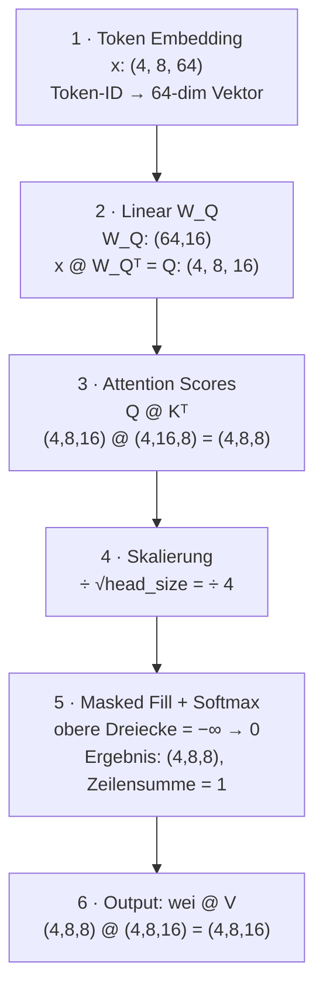

# Vektor · Matrix · Tensor

> Ein visueller Crashkurs für Machine-Learning & Transformer — keine Vorkenntnisse nötig

## Inhalt

- [0 · Skalare — das Fundament](#0--skalare--eine-einzelne-zahl)
- [1 · Vektoren — Richtung & Größe](#1--vektoren--eine-liste-von-zahlen)
- [2 · Matrizen — Tabellen von Zahlen](#2--matrizen--ein-raster-aus-zahlen)
- [3 · Matrixmultiplikation — das Herzstück](#3--matrixmultiplikation--das-herzstück)
- [4 · Tensoren — Matrizen in 3D+](#4--tensoren--matrizen-in-mehreren-dimensionen)
- [5 · Im Transformer konkret](#5--wie-alles-im-transformer-zusammenkommt)

---

## 0 · Skalare — eine einzelne Zahl

Ein **Skalar** ist einfach eine einzelne reelle Zahl. Alle anderen Strukturen bauen darauf auf.

| Beispiele | In PyTorch |
|-----------|-----------|
| Lernrate: `0.001` | `torch.tensor(3.7)` |
| Temperatur: `1.4` | Form: `()` — nulldimensional |
| Attention-Score: `3.7` | *(kein Batch, kein Vektor)* |

---

## 1 · Vektoren — eine Liste von Zahlen

Ein **Vektor** ist eine geordnete Liste von Skalaren. Er hat eine Dimension (Länge) `n`.

### Visuelle Vorstellung

Ein Vektor der Länge 4 — als Zeile oder Spalte:

```
Zeilenvektor (1 × 4):   [ 1.2  |  0.5  | −0.8  |  2.1 ]

Spaltenvektor (4 × 1):  [ 1.2 ]
                        [ 0.5 ]
                        [−0.8 ]
                        [ 2.1 ]
```

### Grundoperationen

**Addition (elementweise)** — beide Vektoren müssen gleich lang sein:
```
  [1, 2, 3]
+ [4, 5, 6]
  ─────────
= [5, 7, 9]
```

**Skalierung (Skalar × Vektor)** — jedes Element wird multipliziert:
```
2 × [1, 2, 3]
  ─────────
= [2, 4, 6]
```

### Skalarprodukt (Dot Product) ← besonders wichtig!

$$\mathbf{a} \cdot \mathbf{b} = \sum_i a_i \cdot b_i = a_1 b_1 + a_2 b_2 + \ldots + a_n b_n$$

Ergebnis: **ein Skalar** — misst, wie ähnlich / ausgerichtet zwei Vektoren sind.

```
a = [1, 2, 3]   b = [4, 5, 6]
a · b = 1×4 + 2×5 + 3×6 = 4 + 10 + 18 = 32
```

> **Warum ist das so wichtig?**  
> Wenn Query-Vektor **q** und Key-Vektor **k** eines Tokens in die gleiche Richtung zeigen,
> ist ihr Dot Product groß → hoher Attention-Score → das Token wird stark beachtet.

### Kosinus-Ähnlichkeit — normiertes Dot Product

$$\cos(\theta) = \frac{\mathbf{a} \cdot \mathbf{b}}{\|\mathbf{a}\| \times \|\mathbf{b}\|}$$

Wert zwischen −1 und 1: `1` = gleiche Richtung, `0` = orthogonal, `−1` = entgegengesetzt.

---

## 2 · Matrizen — ein Raster aus Zahlen

Eine **Matrix** ist ein 2D-Raster mit `m` Zeilen und `n` Spalten — kurz `m × n`.

**Matrix A (3 × 4):**
```
┌  1   2   3   4 ┐
│  5   6   7   8 │
└  9  10  11  12 ┘
```

### Transponieren — Zeilen und Spalten tauschen

Die **Transponierte** $A^\top$ entsteht, indem Zeilen zu Spalten werden.  
Eine `(m × n)`-Matrix wird zu einer `(n × m)`-Matrix.

```
A (2 × 3)        Aᵀ (3 × 2)
┌ 1  2  3 ┐      ┌ 1  4 ┐
└ 4  5  6 ┘  →   │ 2  5 │
                  └ 3  6 ┘
```

In `model.py` passiert das bei: `k.transpose(-2, -1)` — die letzten zwei Achsen werden getauscht.

---

## 3 · Matrixmultiplikation — das Herzstück

Die Matrixmultiplikation `C = A @ B` kombiniert eine `(m × k)`-Matrix mit einer `(k × n)`-Matrix zu einer `(m × n)`-Matrix. **Die innere Dimension muss übereinstimmen!**

$$C[i,j] = \text{Zeile } i \text{ von } A \;\cdot\; \text{Spalte } j \text{ von } B \quad \text{(Skalarprodukt!)}$$

### Schritt-für-Schritt-Beispiel (2×3 @ 3×2 = 2×2)

```
A (2×3)      B (3×2)      C (2×2)
┌ 1  2  3 ┐  ┌  7   8 ┐   ┌  58   64 ┐
└ 4  5  6 ┘  │  9  10 │ = └ 139  154 ┘
             └ 11  12 ┘
```

1. **C[0,0]:** `1×7 + 2×9 + 3×11 = 7 + 18 + 33 = 58`
2. **C[0,1]:** `1×8 + 2×10 + 3×12 = 8 + 20 + 36 = 64`
3. **C[1,0]:** `4×7 + 5×9 + 6×11 = 28 + 45 + 66 = 139`
4. **C[1,1]:** `4×8 + 5×10 + 6×12 = 32 + 50 + 72 = 154`

### Merkhilfe: Dimensionen

$$\underbrace{(m \times k)}_{A} \;@\; \underbrace{(k \times n)}_{B} \;=\; \underbrace{(m \times n)}_{C}$$

```
(m × k) @ (k × n)  =  (m × n)
         ↑↑
    müssen gleich sein!
```

> **Achtung:** Matrixmultiplikation ist *nicht kommutativ*: `A @ B ≠ B @ A` (i. d. R.). Reihenfolge ist entscheidend!

### Warum ist das im Transformer so zentral?

`nn.Linear(in, out)` führt intern genau eine Matrixmultiplikation durch: $y = x \cdot W^\top$.  
Das ist das "Lernen" — die Gewichtsmatrix $W$ wird durch Backpropagation so angepasst, dass das Ergebnis sinnvoll wird.

---

## 4 · Tensoren — Matrizen in mehreren Dimensionen

Ein **Tensor** ist eine Verallgemeinerung: Skalare (0D), Vektoren (1D) und Matrizen (2D) sind alle Spezialfälle.

| Dim | Typ | Form | Beispiel |
|-----|-----|------|---------|
| **0D** | Skalar | `()` | Loss-Wert `2.34` |
| **1D** | Vektor | `(n,)` | Token-Embedding der Länge 64 |
| **2D** | Matrix | `(m, n)` | Gewichtsmatrix $W_Q$ |
| **3D** | Tensor | `(B, T, C)` | Batch von Sequenzen |

### Der 3D-Tensor im Transformer: (B, T, C)

Das ist die zentralste Form in `model.py`:

```
Tensor x mit Form (B=2, T=3, C=4):

  Batch 0:                    Batch 1:
  ┌──────────────────┐        ┌──────────────────┐
  │Token0: [a,b,c,d] │        │Token0: [e,f,g,h] │
  │Token1: [a,b,c,d] │        │Token1: [e,f,g,h] │
  │Token2: [a,b,c,d] │        │Token2: [e,f,g,h] │
  └──────────────────┘        └──────────────────┘
       ↑ T=3 Tokens                ↑ T=3 Tokens
       jeder mit C=4 Werten
```

| Dimension | Bedeutung |
|-----------|-----------|
| **B** = Batch-Größe | Wie viele Texte werden *parallel* verarbeitet. Kein Einfluss auf die Logik — nur Effizienz. |
| **T** = Sequenzlänge | Wie viele Tokens die Sequenz hat. Max = `block_size`. |
| **C** = Kanäle (`n_embd`) | Die Vektordimension jedes Tokens. Größer = mehr "Ausdrucksvermögen". |

### Batched Matrix Multiplication mit `@`

PyTorch wendet `@` auf Tensoren "batched" an: die ersten Dimensionen werden als Batch-Achsen behandelt, nur die letzten zwei werden multipliziert.

```
Q: (B, T, head_size)
K: (B, T, head_size)

Q @ Kᵀ = Q @ K.transpose(-2,-1)

      (B, T, head_size) @ (B, head_size, T)
                     ↑↑         ↑↑
               innere Dims stimmen überein
   =  (B, T, T)   ← für jedes Batch-Element: T×T Attention-Matrix
```

> **PyTorch erledigt das für alle B Batch-Elemente gleichzeitig** — kein manuelles Schleifenschreiben nötig. Das ist "Batched MatMul".

### Wichtige Tensor-Operationen im Transformer

| Operation | Beschreibung | Beispiel |
|-----------|-------------|---------|
| `reshape` / `view` | Form ändern ohne Daten zu kopieren | `(B*T, C) ↔ (B, T, C)` |
| `torch.cat` | Tensoren entlang einer Achse zusammenfügen | `(B,T,hs) + (B,T,hs) → (B,T,2hs)` |
| elementweise Ops | Addition, Multiplikation etc. auf gleichen Positionen | `x + y`, `x * y` |

---

## 5 · Wie alles im Transformer zusammenkommt

Konkrete Dimensionen aus `model.py` (Beispielwerte: `n_embd=64, head_size=16, T=8, B=4`):



| Schritt | Operation | Eingabe-Shape | Ausgabe-Shape |
|---------|-----------|--------------|--------------|
| 1 | Token Embedding | Token-IDs `(4, 8)` | `(4, 8, 64)` |
| 2 | Linear $W_Q$ | `(4, 8, 64)` | `(4, 8, 16)` |
| 3 | $Q \cdot K^\top$ | `(4, 8, 16)` @ `(4, 16, 8)` | `(4, 8, 8)` |
| 4 | Skalierung $/ \sqrt{16}$ | `(4, 8, 8)` | `(4, 8, 8)` |
| 5 | Masked Fill + Softmax | `(4, 8, 8)` | `(4, 8, 8)` |
| 6 | $\text{wei} \cdot V$ | `(4, 8, 8)` @ `(4, 8, 16)` | `(4, 8, 16)` |

---

## Schnell-Referenz: Dimensionsregeln

```
Matmul:    (a, b, c) @ (a, c, d)  →  (a, b, d)   # innere Dim muss stimmen
Transpose: (a, b, c).T[-2,-1]     →  (a, c, b)   # letzte 2 Achsen tauschen
Cat:       (a,b,c) + (a,b,c) dim=-1  →  (a,b,2c) # entlang letzter Achse stapeln
Broadcast: (a,1,c) + (1,b,c)      →  (a,b,c)     # automatisches Dehnen
```
